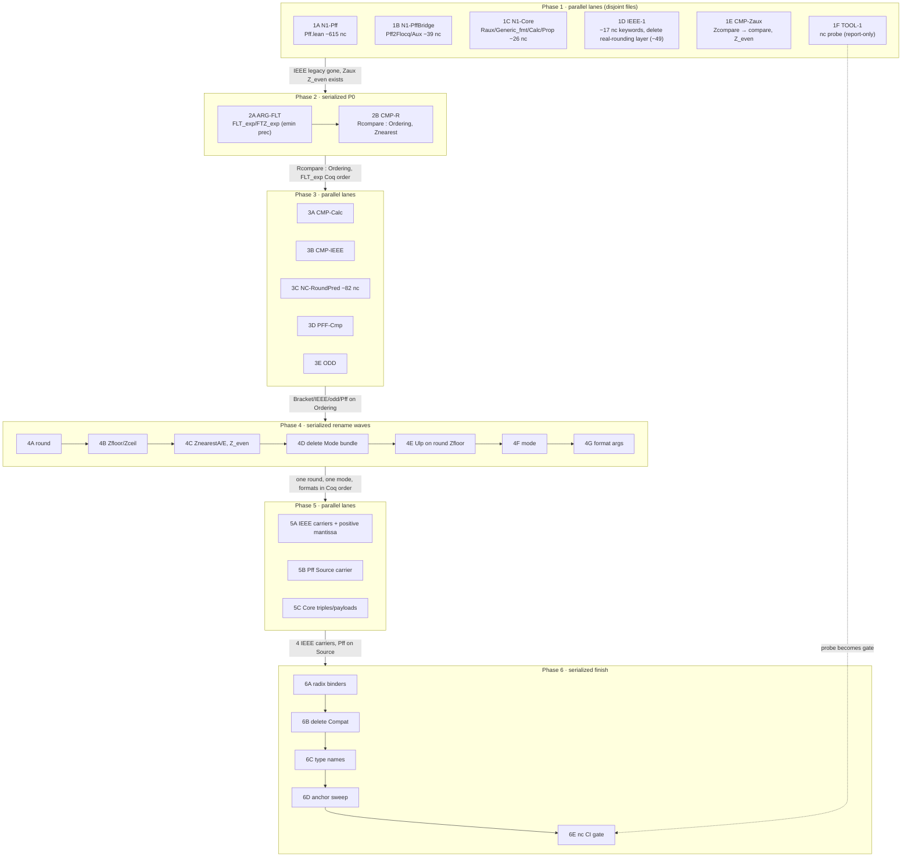

<!-- Generated 2026-09-22 by a read-only audit of main f633f081 against Flocq 7aab8f55.
Paths under scratch/ refer to the audit session's scratch evidence, which is not kept; counts and file:line citations are reproducible from the sources. The critic's corrections at the end override the plan where they conflict. -->

# FloatSpec ↔ Flocq conventions: ranked hard-cutover plan

- **Baseline:** FloatSpec snapshot `f633f081` (Lean 4.34.0 + Mathlib) against Flocq `7aab8f55` under Rocq 9.1. All line numbers refer to that snapshot.
- **Inputs:** four read-only audits: the noncomputable census, rounding, comparisons, and types/argument order. Their evidence is in `scratchpad/conventions/{nc,rounding,compare,types-argorder}/`.
- **What is new here:** every deviation below comes from those audits. The plan adds only two things of its own:
  - blast-radius recounts against the snapshot, marked *recount*;
  - tooling facts read from `scripts/` and `.github/workflows/ci.yml`.
- **Policy (owner):**
  - Hard cutover. No shims, aliases or legacy names survive a batch.
  - Faithful to Flocq's rounding functions and modes, comparison encodings, integer carriers, argument order and names, unless §6 gives a concrete reason.
  - `noncomputable` stays only where code generation actually fails.

---

## 0. Summary

1. **P0 behaviour: IEEE ops that round the wrong way.**
   - Which: the root `Bplus`/`Bminus`/`Bmult`/`Bfma`/`Bdiv`/`Bsqrt`/`Bnearbyint`/`Bfrexp` (Binary.lean:1475–1623) and `BinarySingleNaNBridge.*` (Binary.lean:1198–1453).
   - What they do: round the exact real in ℝ, then rebuild the float with `real_to_FullFloat`. They never overflow; the rounding audit proved `roundReal mode r ≠ infinity s` (rounding/Probe2.lean).
   - Why it matters: they carry Flocq names, are noncomputable, and an unqualified name resolves to them instead of the faithful computable `Binary.*`/`BinarySingleNaN.*` ops.
2. **P0 silent hazard: two `FLT_exp`s with opposite argument order.**
   - Core `FLT.FLT_exp prec emin` (FLT.lean:40,50) versus the Compat root alias `FLT_exp emin prec` (Compat.lean:52–55).
   - `FLT_exp (-1074) 53 0` evaluates to −53 at the root and to 1074 inside `FloatSpec.Core.FLT` (types-argorder/C5.lean).
3. **P0 encoding: `Rcompare` returns Int.**
   - `Raux.Rcompare : ℝ → ℝ → Int` (Raux.lean:683), where Coq returns `comparison` (Raux.v:349).
   - Consequences: `Znearest` matches `-1 | 0 | _` (Generic_fmt.lean:1928–1933), and three different real comparators coexist.
4. **P1 rounding names.**
   - Flocq's single `round` is split three ways: `roundR`, `round` and `round_to_generic`.
   - A Lean-only `Calc.Round.Mode` bundle exists, plus a root `Znearest` of a different type (Compat.lean:135).
   - `ZnearestA` is a choice function (Generic_fmt.lean:3572). There is no `ZnearestE`; instead there are 143 inline lambdas.
   - `RoundingMode` is used where Flocq has `mode`.
   - 12 Ulp theorems are stated about `Classical.choose` witnesses.
5. **noncomputable** (the owner's stated priority). 1042 FloatSpec constants are tagged today.
   - **705** compile once the keyword is deleted. Each file was validated with `warningAsError`.
   - **41** legacy real-based IEEE ops, **145** Lean-only classical `_check` stubs, **13** payload helpers and **9** Compat shims go away by deleting the declarations.
   - At most **129** genuinely need the keyword: 117 faithful definitions plus 12 test clients. Each goes through ℝ order, floor, zpow, log or classical choice, which is exactly where Coq's R is axiomatic too. N4 deletes 15–20 of the 117 as duplicates.
   - Phase 1 alone removes 746: the 705 removable declarations (680 keyword deletions outside IEEE, 17 inside IEEE, 8 deleted along with `ExperimentalBinaryRound`) plus the 41 legacy IEEE ops deleted in batch 1D.

**Endpoint:** tagged constants go from 1042 to about 110–130. Every Flocq name refers to exactly one Lean object, with Flocq's argument order. Comparisons use `Ordering`. There is a single `round`, a single `mode`, a single `Znearest`, and `ZnearestA`/`ZnearestE` as Flocq defines them.

---

## 1. Schedule

- **Odd phases** run parallel lanes. Each lane owns a set of files and gets its own worktree.
- **Phases 2, 4 and 6** are serialized cross-cutting batches: one at a time, each merged before the next starts. They are mechanical, compiler-guided rewrites that cannot be split by file.



Every batch ends with the common verification recipe in §3 and is merged to `main` before any dependent batch starts.

---

## 2. Ranked batch table

The rank combines severity (audit priority), the owner's emphasis (rounding fidelity and noncomputable removal) and how many later batches the batch unblocks. The phase column gives execution order.

| Rank | Batch | Change | Audit prio | Phase | Depends on | nc Δ (census) |
|---:|---|---|---|---|---|---|
| 1 | **1D IEEE-1** | Delete the real-rounding IEEE layer; IEEE keyword-only removals | P0 | 1 | — | −66 (17 keywords, 8 Experimental defs deleted, 41 legacy ops deleted) |
| 2 | **1A/1B/1C N1** | Delete the 680 keyword-only `noncomputable` outside IEEE | owner P1 | 1 | — | −680 |
| 3 | **2A ARG-FLT** | `FLT_exp`/`FTZ_exp` in Coq order `(emin prec)` | P0 | 2 | 1C, 1D | 0 |
| 4 | **2B CMP-R** | `Rcompare : ℝ → ℝ → Ordering`, Coq-shaped lemma family, `Znearest` on Ordering | P0 | 2 | 1D, 1E | ≈−27 (Raux carriers) |
| 5 | **4A RND-round** | One `round` (delete `roundR` and `round_to_generic`) | P1 | 4 | 2B | −2 |
| 6 | **4D RND-mode-bundle** | Delete `Calc.Round.Mode`, `Calc.Round.round`, Compat `Znearest`/`ZnearestMode` | P1 | 4 | 4A, 4C, 3E | ≈−3 |
| 7 | **4C RND-nearest** | `ZnearestA`/`ZnearestE`/`Znearest0` as in Flocq; one Bool parity | P1 | 4 | 4A, 1E | +2 (new faithful ℝ abbrevs) |
| 8 | **4F IEEE-mode** | `RoundingMode` → `mode` (`mode_NE…mode_NA`), `round_mode` | P1 | 4 | 4C, 3B | −1 |
| 9 | **4E RND-ulp** | 12 Ulp theorems stated on `round beta fexp Zfloor/Zceil` | P1 | 4 | 4A, 4B | −3 |
| 10 | **3B CMP-IEEE** | Inline source sign clauses; delete `RcompareOrdering`; `float_comparison` order | P1/P3 | 3 | 2B | ≈−5 |
| 11 | **3A CMP-Calc** | Bracket on `Rcompare`; source-shaped location functions; Calc/Round duplicates | P1/P2 | 3 | 2B, 1E | ≈−1 |
| 12 | **3C NC-RoundPred** | Delete the classical Bool `_check` carriers in Round_pred/Round_NE | P2 (nc) | 3 | 1C | ≈−82 |
| 13 | **5A IEEE-carriers** | Four Coq carriers; positive mantissa; explicit prec/emax; Bits; shr names | P1–P3 | 5 | 4F, owner decision O1 | −n (legacy real views) |
| 14 | **4G FMT-args** | Format sections as `(beta) [ValidRadix] (emin prec)`; inductive formats; `Prec_gt_0` | P1/P2 | 4 | 2A, 1E | 0 |
| 15 | **5B PFF-carrier** | Pff integrated layer onto the Source carrier; `Fbound`; single `Positive` | P1 | 5 | 3D, owner decision O1 | ≈−4 |
| 16 | **4B RND-floor** | `rnd_floor`/`rnd_ceil` → `Zfloor`/`Zceil`; Flocq instance names | P2 | 4 | 4A | −2 |
| 17 | **5C CORE-triples** | Direct Zfloor/Zceil/Ztrunc/Zaway propositions; remaining carriers and payloads | P2 | 5 | 2B, 4B | ≈−20 |
| 18 | **3E ODD** | `Zrnd_odd` primary; delete `Zodd`/`oddMode`; namespace; private `m` | P2 | 3 | 1E | ≈−3 |
| 19 | **3D PFF-Cmp** | Pff `Z_eq_bool`/`Zcompare_correct` direct; `pff_compare : Ordering`; delete `PffRounding` | P2 | 3 | 1A | −2 |
| 20 | **1E CMP-Zaux** | Delete `Zaux.Zcompare` (use `compare`); drop the debris; add `Z_even` | P2 | 1 | — | 0 |
| 21 | **6A RADIX** | `[ValidRadix beta]` on bare-Int cores; drop the redundant `1 < beta` premises | P2/P3 | 6 | 5A–5C | 0 |
| 22 | **6B COMPAT** | Delete Compat.lean; make beta implicit on Calc float ops | P2/P3 | 6 | 2A, 4A, 4D | −9 |
| 23 | **6C NAMES** | `float`, `spec_float`, `shr_record`, `location`, `Satisfies_any`, `monotone_exp` | P3 | 6 | 5A, 5B | 0 |
| 24 | **6D ANCHORS** | Anchor sweep (about 100 new anchors); full statement-audit rerun | P2 | 6 | all | 0 |
| 25 | **6E NC-GATE** | CI gate: no removable `noncomputable`; the IdReturn linter sees through modifiers | — | 6 | 1F, 1B, 3C | 0 |
| 26 | **1F TOOL-1** | Noncomputable probe as a script, report-only | — | 1 | — | 0 |

**File ownership per lane**, checked for disjointness within each parallel phase:

- **Phase 1**
  - 1A: `Pff/Pff.lean`.
  - 1B: `Pff/Pff2Flocq.lean`, `Pff/Pff2FlocqAux.lean`.
  - 1C: `Core/Raux.lean`, `Core/Generic_fmt.lean`, `Core/Round_pred.lean`, `Compat.lean`, `Calc/Bracket.lean`, `Calc/Round.lean`, `Prop/Round_odd.lean`, `Prop/Double_rounding.lean`.
  - 1D: `IEEE754/Binary.lean`, `IEEE754/BinarySingleNaN.lean`, `IEEE754/BinarySingleNaNSourceFacade.lean`, `IEEE754/Decoder.lean`, `Test/SourceCorrectnessAliases.lean`, `docs/THREE_VERIFICATION_LOOPS.md`, `src/IEEE754/PrimFloat_theorem_changes.md`.
  - 1E: `Core/Zaux.lean`, `Test/ZauxSource.lean`.
  - 1F: `scripts/` (new files only), `.github/workflows/ci.yml`.
- **Phase 3**
  - 3A: `Calc/{Bracket,Sqrt,Div,Round}.lean`, plus one hunk at `BinarySingleNaN.lean:1645`.
  - 3B: `IEEE754/{BinarySingleNaN,BinarySingleNaNSourceFacade,ComputableCompare,PrimFloat}.lean`, `Test/SourcePremiseContracts.lean`, `Test/PrimFloatSource.lean`.
  - 3C: `Core/Round_pred.lean`, `Core/Round_NE.lean`.
  - 3D: `Pff/*`, `Test/PffAuxExecution.lean`, `Test/PffRoundingSource.lean`, `scripts/test_pff_aux_bridge.py`.
  - 3E: `Prop/Round_odd.lean`, plus one `Zodd` line in `Calc/Round.lean`.
  - Merge order within the phase: 3A, then 3E, then 3B. The single-hunk overlaps then rebase cleanly.
- **Phase 5**
  - 5A: `IEEE754/*`, `Core/Digits.lean` (for `digits2_pos`), the IEEE fixtures, and the `scripts/*ieee*`/`flocq_bridge.py` adapters.
  - 5B: `Pff/*` and the Pff tests and bridges.
  - 5C: `Core/{Raux,Generic_fmt,FLT,FLX,FTZ}.lean`, `Calc/Div.lean`, `Prop/{Double_rounding,Relative}.lean`.

---

## 3. Common verification recipe (every batch)

**V0 Rebase and baseline.**
- Branch from current live `main`. It may have moved past `f633f081`, since Codex edits `~/FloatSpec` live.
- Rerun the batch's `rg` counts. For any noncomputable batch, rerun `nc/Probe.lean` (`lake env lean`, `Elab.async false`).
- Record the baseline anchor list (`lake env lean scripts/ExportFlocqSources.lean`, 456 anchors at `f633f081`) and the compiled inventory (`lake env lean scripts/ExportPortInventory.lean`).

**V1 Build.**
- `lake build FloatSpec.Test FloatSpecTests floatspec`. The lakefile's leanOptions apply, including warningAsError.
- Use `lean_diagnostic_messages` per edited file while iterating.

**V2 Fixtures.**
- CI list:
  - `for f in BooleanComparison PrimitiveComparison PrimitiveConversion PrimitiveExecution RawIEEERounding RawOverflow SingleNaNArithmetic SingleNaNHelpers FrexpLaws Normalization CalcBrack PffIntegerExecution ZauxPreludeContracts ZauxPowerRadixContracts ZauxDivisionContracts RoundPredSourceContracts RoundPredTieContracts; do lake env lean scripts/fixtures/$f.lean; done`
  - `lake env lean --run scripts/fixtures/GuidedDemo.lean`
- The batch-specific non-CI fixtures named in its spec.
- The Rocq fixtures (`coqc -q -R Deps/flocq/src Flocq scripts/fixtures/{ArithmeticProperties,BitsProperties,BitOrderProperties,RoundingOracle,IntegerRounding,CorePremiseBoundary,ExponentValidityBoundary}.v`). Rerun them whenever a paired `.lean` twin changes.

**V3 Anchors.**
- `python3 scripts/validate_flocq_source_refs.py Deps/flocq` and `python3 scripts/test_flocq_source_refs.py -v`.
- Diff the anchor list against V0. Any anchor that disappears must have a surviving twin or be moved in the same commit; list the moves in the commit message.
- Every newly Flocq-named declaration gets `@[flocq_source …]`.

**V4 Anchor statement audit, rerun for touched anchors.**
- Method: `ANCHOR_STATEMENT_AUDIT_2026-09-22.md`. Compare Lean `#check @X` (`pp.proofs false`) with Rocq `Check @X` / `About X` / `Print X`.
- Update `FloatSpec/docs/anchor_statement_audit.json`. Where a migration turns a `triple-shaped` verdict into `match`, record that.

**V5 Bridges.**
- The CI invocation:
  - `opam exec --switch=floatspec-rocq -- python3 scripts/flocq_bridge.py --flocq-dir Deps/flocq --seed 865509 --samples 5 --batch-size 100 --operations <ops> --skip-build --output …`
  - the four replays (`RawIEEERoundingReplay`, `RawOverflowReplay`, `PrimitiveComparisonReplay`, `PrimitiveConversionReplay`);
  - `uv run scripts/test_flocq_bridge.py -v`;
  - `python3 scripts/run_required_rocq_tests.py --flocq-dir Deps/flocq`.
- The batch-specific `scripts/test_*.py`.
- At the end of each phase: `bash scripts/test_flocq_conformance.sh`.

**V6 Review-queue fingerprints.**
- Run `python3 scripts/flocq_port_queue.py --check-lean-reviews --skip-build`.
- The gate compares `type_hash`, `value_hash` and `noncomputable` for each reviewed Lean name. If it fails with "compiled declaration changed since manual review", re-review that entry, then refresh its `lean_fingerprints` in `FloatSpec/docs/source_review_queue.json`. Never refresh without a re-review.
- *Recount* of the reviewed set: 122 entries and 193 fingerprints (Zaux 105, Round_pred 84, RoundNE 3, Flocq_version 1).
  - Only `round_val_of_pred` and `round_fun_of_pred` are `noncomputable: true`, and both stay that way.
  - No reviewed name matches `compare|_check|_spec`.

**V7 Hygiene.**
- `python3 scripts/check_proof_debts.py`
- `python3 scripts/check_compiled_trust.py`, and again with `--scope tests`
- `scripts/test_audit_placeholders.sh`, `scripts/test_coq_source_linter.sh`, `scripts/test_unused_mvcgen.sh`
- `scripts/status_report.sh --write`, then commit `status.{json,md}`
- The CI hygiene `rg` (`binary_(add|mul|sub|fma|div|sqrt)_correct.*: Unit` must stay empty).
- Keep `.log/` commit logs untracked: CI rejects tracked `.log/**`.

**V8 noncomputable census.**
- Rerun the probe (1F's script once it lands). The per-file tagged and removable counts must hit the batch's nc Δ.
- A batch must never add a removable `noncomputable`.

---

## 4. noncomputable batches, in dependency order

These are split out as the owner asked. Each N-step is carried out inside the batch named. The accounting uses `nc/census.tsv`: 1042 rows, 705 removable and 337 necessary.

| Step | Where | What | Depends on | Tagged after |
|---|---|---|---|---:|
| **N1** keyword deletion | 1A (615), 1B (39), 1C (26), 1D-i (17 + the 8 ExperimentalBinaryRound defs, deleted outright in 1D-ii) | Delete exactly the 705 `removable` census rows | nothing | 337 |
| **N2** legacy IEEE deletion | 1D-ii | Delete the 41 `legacy_real_based_IEEE_ops` rows. Computable anchored replacements already exist, so no retranscription is needed | nothing | 296 |
| **N3** Lean-only classical carriers | 3C (≈82 Round_pred/Round_NE `_check : Id Bool`); 2B (≈27 Raux comparison carriers); 5A/5C/5B (remaining `*_format_0_check`, `B2R_*_check`, the 13 Raux payload helpers, `Calc/Div.lean:70`, Pff2Flocq `Dekker_round`/`Dekker_t4`/`Fast2Sum_round`/`TwoSum_round`, Double_rounding `midp`/`midp'`, Relative `u_ro`, Round_odd `m`) | Delete the stubs together with their Hoare triples. Direct Coq-named theorems already exist for 61/61 Round_pred and 18/20 Round_NE carriers | 2B for the Raux carriers; nothing otherwise | ≈138 |
| **N4** duplicates and shims | 3A `Bracket.compare`; 3B `RcompareOrdering` plus 4 sign helpers; 4A the `roundR`/`round_to_generic` aliases; 4B `rnd_floor`/`rnd_ceil`; 3E/4D `oddMode`, `Calc.Round.round`, `nearestEvenMode`; 4E `round_{DN,UP,N}_to_format`; 4F facade `round_mode`; 5A legacy-carrier real views; 3D `pff_to_flocq_rnd` and the `PffRoundingSource` client; 6B the 9 Compat shims | Deleted as part of the naming cutovers | the rename batches | ≈110–130 |
| **N5** enforcement | 6E | CI fails if any `noncomputable` declaration compiles without the keyword. `IdReturnLinter` also matches declarations that carry modifiers | N1–N4 | — |

**N1 mechanics** (validated):
- The source of truth is `nc/census.tsv`, rows with `status=removable`.
- Per-file edited copies already compile under warningAsError: `nc/validate/V1…V13` for files and `S1…S3` for sections. For example, V9 is `Pff.lean` with 615 deletions and 0 errors in 119 s.
- Produce the patch by diffing each copy against the source, after dropping the appended `run_cmd` `!isNoncomputable` assertion.
- 12 declarations are removable **only jointly**, all in `Experimental*`:
  - Binary.lean:5106, 5137, 5163, 5168, 5192;
  - BinarySingleNaN.lean:2990, 3079, 3948, 3980, 3984, 3998, 4043.
- There is one known interaction. `IdReturnLinter.lean:44,47` ignores any def that has a modifier (confirmed by `nc/LintProbe.lean`). Once the keyword goes, 14 of the 15 Pff2FlocqAux `Id Unit` stubs become visible to the linter and trip `linter.noIdReturn`; see 1B.
- Removing the keyword never changes callers. Lean does not warn about an unneeded `noncomputable`, which is why 6E adds a gate.

**Required remainder** (§6 row E1): about 117 faithful ℝ-valued or classical definitions, minus the duplicates deleted in N4, plus about 11 test clients of the classical APIs, plus the new `ZnearestA`/`ZnearestE` abbrevs. Their failure roots in the census are:

| Root | Count |
|---|---:|
| `Real.instDivInvMonoid` | 75 |
| `Real.decidableEq` | 71 |
| `Real.decidableLT` | 63 |
| `Classical.propDecidable` | 51 |
| `Real.linearOrder` (FloorRing) | 22 |
| `Real.decidableLE` | 21 |
| `Classical.dec` | 20 |
| `Classical.choose` | 7 |
| `Real.sqrt` | 6 |
| `Real.exp` | 1 |

---

## 5. Batch specifications

### Phase 1 (parallel)

#### 1D · IEEE-1: delete the non-Flocq real-rounding IEEE layer, and the IEEE keyword-only removals

*Rank 1 · P0 · lane IEEE*

**Evidence.** The rounding, noncomputable and comparison audits all flag this layer:
- It rounds `B2R x ∘ B2R y` in ℝ through `round_to_generic` and `rnd_of_mode`, then rebuilds the float with `real_to_FullFloat` (Binary.lean:1070).
- It has no `binary_overflow` branch.
- `binary_add` always rounds with `Ztrunc`.
- The `Binary754.valid` field is trivially true, because the invariant `is_finite_FF val = true → True` (Binary.lean:491–495) constrains nothing.
- `Bnearbyint` leaves its result at exponent 0.
- Everything in the layer is noncomputable, whereas Flocq's versions are computable: `vm_compute` gives closed values for `b64_plus`, `b64_div`, `b64_sqrt`, `b64_compare`, `Btrunc`, `Bsucc`, `Bpred`, `Bfrexp` and `Bnearbyint` (`nc/coq_compute.out`).

**Part i: keyword-only removals.**
- `valid_rnd_of_mode` (Binary.lean:1100).
- The 14 `ExperimentalSingleNaNArithmetic` declarations, including `Bldexp` :2984, `Bulp` :3927, `Bulp'` :3948, `Bplus` :3954, `Bminus` :3980, `Bpred_pos'` :3984, `Bsucc'` :3998, `Bsucc` :4013, `Bpred` :4043 and 5 checks.
- `valid_rnd_round_mode` (Facade:62) and `valid_round_mode` (Facade:68).
- Narrow `noncomputable section` in `Decoder.lean:36–195` to a plain `section` with `noncomputable def toReal` (:49) (S2).
- Make `Test/SourceCorrectnessAliases.lean:247–297` a plain `section` (S1).
- Delete the dead block-commented `noncomputable def` at Binary.lean:2820 and :3079.

**Part ii: delete.**
- The whole `BinarySingleNaNBridge` namespace (Binary.lean:1198–1453): `roundReal` :1262, `Bmult` :1269, `Bplus` :1277, `Bminus` :1299, `Bfma` :1331, `Bdiv` :1382, `Bsqrt` :1411, `Bnearbyint` :1431, `Btrunc` :1450, and its `BinaryFloat`/`B2R` :1200/:1206.
- The root `Binary754` ops `Bplus` :1475, `Bminus` :1504, `Bmult` :1523, `Bfma` :1543, `Bdiv` :1563, `Bsqrt` :1582, `Bnearbyint` :1600, `Bfrexp` :1623, and `Bfrexp_correct_check` :1643.
- The compat shims `binary_add` :1486, `binary_sub` :1184, `binary_mul` :1610, `binary_div` :1797, `binary_sqrt` :1821, `binary_fma` :1838, `binary_nearbyint` :2802 and `binary_ldexp` :3057.
- The helpers `real_to_FullFloat` :1071, `real_sign_or_sub_zero` :1157 and `real_sign_or_fma_zero` :1174.
- The legacy `Bsucc` :3320, `Bpred` :3402, their checks :3331/:3413, `Btrunc` :3533, `binary_trunc` :3538 and `Btrunc_correct_check` :3542.
- The legacy comparison:
  - in Binary.lean: `Bcompare_rcompare_swap` :3819, private `BcompareSF` :3829, `_root_.Bcompare : Option Int` :3884, `Bcompare_check` :3891, `Bcompare_correct_compat` :3895 and `Bcompare_swap_compat` :3913;
  - in the facade: `BcompareIntCompat` :234 and `orderingOfCompareCode`/`orderingOfCompareCode_Rcompare` :238–279.
- The `ExperimentalBinaryRound` namespace (Binary.lean:5089–5217). Its `binary_round_aux` ignores both `mode` and `lx`, yet its theorems reuse Flocq's `*_correct` names.
- The BinarySingleNaN.lean real prototypes `B754_round_real` :2852, `B754_round_real_signed_zero` :2857, `B754_plus` :2927, `B754_mult` :2933, `B754_div` :2939 and `B754_sqrt` :2945.
- `Bsqrt_correct_aux_from_assumed_rounding` (BinarySingleNaN.lean:4061–4096), which assumes its own conclusion and uses `Mode`.
- Any theorem whose statement mentions a deleted definition. Those theorems are about non-Flocq functions.
- The `Binary754` carrier itself stays until 5A.

**Faithful targets.** All of these already exist, are computable and are anchored:
- `Binary.*` in BinarySingleNaN.lean: `Bplus` :7317, `Bminus` :7556, `Bmult` :7621, `Bdiv` :7683, `Bfma` :8018, `Bsqrt` :6271, `Bnearbyint` :6714, `Btrunc` :6625, `Bsucc` :7280, `Bpred` :7301, `Bfrexp` :7120, and `Bcompare : … → Option Ordering` :15899.
- `BinarySingleNaN.*`: `Bmult` :8187, `Bplus` :8220, `Bminus` :8247, `Bfma` :8262, `Bdiv` :8336, `Bsqrt` :8366 and `Bcompare` :15728.
- The faithful `binary_round_aux`/`binary_round`/`binary_normalize` and their `_correct` theorems: BinarySingleNaN.lean:2513, 2569 and 14141–14157.

**Callers to rewrite.**
- `rg 'BinarySingleNaNBridge\.|binary_add|binary_mul|roundReal|default_B.*_nan'` finds 51 hits, all in Binary.lean.
- `binary_*` compat: 79 references, all in Binary.lean.
- `ExperimentalBinaryRound`: 0 references outside the namespace.
- The legacy `Bcompare` is used in `Test/SourceCorrectnessAliases.lean:235–237`, `docs/THREE_VERIFICATION_LOOPS.md:609–613` and `PrimFloat_theorem_changes.md:52–91`.
- Leave the integer `ExperimentalSingleNaNArithmetic` ops (144 references) for the dedup in 5A.

**Verification.**
- V1–V8.
- Fixtures: RawIEEERounding, RawOverflow, SingleNaNArithmetic, SingleNaNHelpers, Normalization, FrexpLaws, PrimitiveComparison, BooleanComparison.
- Bridge ops `plus,div,sqrt,bits32,bits64` and the replays; `scripts/test_native_ieee_bridge.py`, `test_ieee_integer_bridge.py`.
- Add two `#eval` regressions:
  - `b64_plus` of 1 and 2 gives the bits 4613937818241073152 (types-argorder/C9.lean);
  - `Binary.Bmult .RNE max_float 2` gives +∞ (the constructor becomes `mode_NE` in 4F). That is the case the deleted `roundReal` got wrong.
- V3: every Flocq name that loses an anchor must keep a live twin under `Binary.*`/`BinarySingleNaN.*`.

**Risk: medium-low.** Deleting whole regions cascades to the theorems that mention them. The build is the oracle. Nothing outside Binary.lean depends on the bridge.

#### 1A · N1-Pff: `Pff/Pff.lean`, 615 keyword deletions

*Rank 2 · owner priority · lane Pff*

**Scope.**
- 607 `X_check : Unit := ()` stubs, e.g. `EvenSOdd_check` :416 and `Axpy_*_check` :36050–36090.
- `Fweight` :6310 (Pff.v:9306), `LSB` :67012 (Pff.v:6017), `MSB` :67333 (Pff.v:6082), `Z_eq_bool` :67501 (Pff.v:388), `Zcompare` :67517 and their checks :67503/:67520.
- `Veltkamp_reducedBound` :734, `Veltkamp_splitBound` :754, and the Prop `Zdivides` :15519.

**Target.** Identical declarations without `noncomputable`. Diff from `nc/validate/V9`.

**Callers.** None.

**Verification.**
- V1.
- `lake env lean FloatSpec/src/Pff/Pff.lean` with the lakefile `-D` options.
- V8: Pff.lean goes from 630 tagged to 15. The 15 that remain are faithful: `FLess` :36100 (Coq uses `Rcase_abs`), `Fulp`, `RND_*`, `IRNDD`/`IRNDU` and similar.
- V6: no reviewed Pff names.

**Risk: low.**
- The Unit stubs are debris of the Hoare-triple encoding. Deleting them with their triples is the eventual hard-cutover fix, as part of the Hoare-triple retirement; this plan does not schedule it.
- Removing the keyword now costs nothing and does not block that later work.

#### 1B · N1-PffBridge: `Pff2Flocq.lean` (24) and `Pff2FlocqAux.lean` (15)

*Rank 2 · lane Pff-bridge*

**Scope.**
- Pff2Flocq.lean: 22 `_check` stubs, e.g. `C_format_check` :864, `Dekker_check` :2124 and `ErrFMA_*_check` :2482–4513; plus the Prop definitions `Fast2Sum_result` :294 and `TwoSum_result` :565.
- Pff2FlocqAux.lean: 15 `_check : Id Unit` stubs at :133, 150, 183, 195, 307, 432, 1903, 1923, 2108, 2200, 2259, 2330, 2374, 2412, 2454.

**Target.** For the 14 stubs that trip `linter.noIdReturn` once visible (V3 log), use one of:
1. `def X_check … : Unit := ()`, if the paired triple wraps the stub with `pure`;
2. otherwise, delete the stub and its triple and state the Coq lemma as a direct proposition.

Do not silence the linter.

**Verification.**
- V1 with warningAsError: 0 `noIdReturn` errors.
- `scripts/test_pff_aux_bridge.py`, `test_pff_bridge.py`.

**Risk: low.**

#### 1C · N1-Core: 26 keyword deletions and the Round_pred section narrowing

*Rank 2 · lane Core*

**Scope.**
- Raux.lean (13):
  - checks :631, 1975, 1990, 2003, 2016, 2112, 3175;
  - ℝ-valued Lean-only helpers `Rsqr_le_abs_0_alt_val` :564, `IZR_cond_Zopp_from_rhs_payload` :2096, `Rabs_lt_inv_pair` :2128, `bpow_lt_bpow_pair` :3437, `bpow_unique_pair` :3459 and `abs_val` :4182. These compile, but the generated code is useless; 5C deletes them.
- Generic_fmt.lean (8):
  - the Prop instances `valid_rnd_ZR` :1755, `valid_rnd_AW` :1768, `valid_rnd_N` :2106, `valid_rnd_NA` :3578 and `valid_rnd_N0` :3633, which are elaborated as theorems, so the keyword is inert;
  - `valid_rnd_Ztrunc` :1765, `ZnearestA` :3572 and `Zrnd_opp` :1778.
- Elsewhere:
  - `Compat.lean:28 generic_format`;
  - `Calc/Bracket.lean:504 inbetween_step_not_Eq_compute`;
  - `Calc/Round.lean:53 Mode.ofRnd`;
  - `Prop/Round_odd.lean:258 valid_rnd_odd`;
  - `Prop/Double_rounding.lean:18 round_round_eq`, which is a Prop.
- Sections (S3): `Round_pred.lean:1379–1691` and `:2153–2575` become plain `section`s, with explicit `noncomputable def` on the 7 auto-tagged `_check`s. 3C deletes those `_check`s later, so this step only makes the tagging explicit in the meantime.

**Note.** 4C redefines `ZnearestA` as the faithful `noncomputable abbrev ZnearestA : ℝ → Int` (§5, 4C). This batch only removes the keyword from the present Int → Bool choice function.

**Verification.**
- V1; V6 (the Round_pred reviewed theorems must not drift).
- Fixtures RoundPredSourceContracts and RoundPredTieContracts.

**Risk: low.**

#### 1E · CMP-Zaux: `Zcompare` becomes Lean `compare`, the debris goes, and the Bool parity function is added

*Rank 20, but it enables 2B, 3A, 4C and 4G · lane Zaux*

**Evidence.**
- `Zaux.lean:1078 Zcompare` is rfl-equal to `compare`.
- `Zcompare_behavior_spec` :1109 is an extra Hoare triple.
- `Zcompare_{Lt,Eq,Gt}_check` :1208/:1233/:1258 are constant functions whose `_spec` triples say nothing about `Zcompare`.
- The Bool section has 19 `_check` defs (e.g. :677) and 21 triples (:597–1285).

**Target.**

```lean
-- Zaux.v:727-760; Lean `compare` on Int is the analogue of Coq `Z.compare`
theorem Zcompare_spec (x y : Int) : Zcompare_prop x y (compare x y)
theorem Zcompare_Lt (x y : Int) : x < y → compare x y = .lt   -- Eq, Gt alike
-- Coq stdlib Z.even : Z -> bool, used by Round_NE.v:26,42, FLT.v:159, BinarySingleNaN.v:1142
def Z_even (z : Int) : Bool := decide (2 ∣ z)                 -- name: owner decision O2
```

- Keep `Zeq_bool`, `Zle_bool` and `Zlt_bool` as `decide`. They are computable and definitionally equal to `Z.eqb`/`leb`/`ltb` (§6 row E4).
- Add anchors for the 28 Zaux.v comparison/bool declarations (Zaux.v:500–760), which have none today.

**Callers.**
- `Zaux.Zcompare`: 18 references, all in Zaux.lean.
- `Test/ZauxSource.lean:22–24`: 3 `#check`s.

**Verification.**
- V1; fixtures ZauxPreludeContracts, ZauxPowerRadixContracts, ZauxDivisionContracts.
- `scripts/test_zaux_prelude_bridge.py`.
- V3 for the new anchors.
- V6: Zaux has 105 reviewed fingerprints. The recount found none among the touched names, so the gate must pass without edits.

**Risk: low.**

#### 1F · TOOL-1: noncomputable probe as a script, report-only

*Rank 26 · lane tooling*

**Scope.**
- Promote `nc/Probe.lean` to `scripts/NoncomputableProbe.lean` with a thin Python wrapper. The probe:
  - makes a copy of each tagged constant, with references redirected and `debug.skipKernelTC`;
  - runs `Lean.compileDecls` over the copies in dependency post-order;
  - relies on the compiler to re-tag copies that fail, as `CoreM.lean:753–761` does.
- Its output has the `census.tsv` shape.
- Add a CI step that only reports, for now.
- Allow-list the 12 control failures: 11 recursive definitions and `mZlist_aux`, which hits an LCNF boxing panic. None of them is a candidate.

**Risk: low.** The probe uses `debug.skipKernelTC` internals. Pin it to Lean 4.34.

### Phase 2 (serialized, P0)

#### 2A · ARG-FLT: `FLT_exp` and `FTZ_exp` in Coq order

*Rank 3 · P0*

**Evidence.**
- `FLT.lean:40` has `variable (prec emin : Int)` and :50 defines `FLT_exp (prec emin e)`. Coq FLT.v:32 declares `Variable emin prec` and :41 defines `FLT_exp e := Z.max (e - prec) emin`.
- The Compat alias `_root_.FLT_exp (emin prec) := FLT.FLT_exp prec emin` (Compat.lean:52–55) re-swaps the order.
- The two orders are mixed in one file: Mult_error.lean:386 versus :822.
- `FTZ.lean:36,47 FTZ_exp (prec emin e)` versus FTZ.v:32,43 `(emin prec)`.

**Target.**

```lean
namespace FloatSpec.Core.FLT
variable (emin prec : Int)                          -- FLT.v:32
@[flocq_source "src/Core/FLT.v" 41 "FLT_exp"]
def FLT_exp (e : Int) : Int := max (e - prec) emin
-- FTZ.lean: FTZ_exp (emin prec e : Int) : Int, body unchanged (FTZ.v:43)
-- Compat.lean:55 → `export FloatSpec.Core.FLT (FLT_exp)` (same constant, no second meaning; gone in 6B)
```

**Callers to rewrite.** Swap the arguments at every Core-order site:
- the 319 qualified `FLT.FLT_exp` (*recount*):

  | File | Sites |
  |---|---:|
  | Binary | 111 |
  | Double_rounding | 67 |
  | BinarySingleNaN | 37 |
  | Test/SourcePremiseContracts | 18 |
  | Mult_error | 16 |
  | Bits | 16 |
  | Pff2FlocqAux | 13 |
  | Pff2Flocq | 11 |
  | Round_odd | 8 |
  | Facade | 5 |
  | Relative | 4 |
  | BitsSourceFacade | 4 |
  | Div_sqrt_error | 3 |
  | Plus_error | 2 |
  | PrimFloat | 2 |
  | Test/CoqSourceLinks | 1 |
  | Compat | 1 |

- about 367 unqualified uses inside FLT.lean (264 of them spelled `FLT_exp prec emin`);
- `Test/FLTDirect.lean` (2);
- `FTZ_exp` (154): FTZ 88, Double_rounding 61, tests 3.

The roughly 1950 root-order (Coq-order) sites need no textual change. Check the generated Lean strings in `scripts/flocq_bridge.py` (4 `FLT_exp` mentions).

**Method (the swap is silent, because both arguments are Int).**
1. **Resolve.** On the base commit, dump the constant each `FLT_exp`/`FTZ_exp` occurrence elaborates to, by file:line:col, using an info-tree walker in the style of `scripts/ExportPortInventory.lean`.
2. **Rewrite.** Swap the arguments only where the site resolved to `FloatSpec.Core.FLT.FLT_exp` or `FloatSpec.Core.FTZ.FTZ_exp`.
3. **Re-resolve.** Every occurrence must now elaborate to the single definition.

**Verification.**
- V1.
- A C5-style probe: `FLT_exp (-1074) 53 0 = -53` both at the root and inside the namespace; `open FloatSpec.Core.FLT` is no longer ambiguous.
- A one-off P1.lean `rfl` bridge (old definition = new definition with the arguments swapped), with `Valid_exp` transferring.
- Bridge op `formats`; `scripts/test_double_rounding_contracts.py`.
- V4 for `FLT_exp`, `FTZ_exp` and the 15 anchored FLT/FLX/FTZ theorems flagged in `cmp2.out`/`cmpT.out`.

**Risk: HIGH, and silent.** It is contained by resolve-then-rewrite plus the numeric probe. Do not batch 2A with anything else.

#### 2B · CMP-R: `Rcompare` to `Ordering`, a Coq-shaped comparison layer, `Znearest` on `Ordering`

*Rank 4 · P0*

**Evidence.**
- Raux.lean:683 defines `Rcompare : ℝ → ℝ → Int`. Its reflection inductive `Rcompare_prop` (:689) is indexed by Int, so `Rcompare_prop x y 5` is well-typed but uninhabited.
- Lemma shapes differ from Coq:
  - Raux.lean:997–1022 state `= -1`/`0`/`1`;
  - `Rcompare_sym` (:762) is `= -(Rcompare y x)`;
  - `Zcompare_int` (:1282) and `Rcompare_IZR` (:1291) go through Int;
  - `Rcompare_F2R` (Float_prop.lean:81) is stated with `Int.sign` and an extra `hbeta`.
- The Coq names `*_spec` (:721, :1563, :1631, :1802) hold triples, while the actual reflection lemmas are published as `*_prop_spec` (:703, :1550, :1618, :1789).
- The Bool `_true`/`_false` lemmas (:1575–1823) and `Rlt_bool_opp` (:1666) are triples.
- `Rcompare_Lt_inv` (:1047), `half_l` (:1341), `half_r` (:1392), `sqr` (:1444) and `Rmin_compare` (:1496) exist only as `_spec` triples.
- The inversion lemmas (:1113, 1166, 1221, 1275) are triples over `Rcompare_val` (:1024).
- Znearest (Generic_fmt.lean:1928–1933) matches on Int codes.
- `binary_normalize_sign` (BinarySingleNaN.lean:14340) matches `-1 | 0 | _`.

**Target.**

```lean
@[flocq_source "src/Core/Raux.v" 349 "Rcompare"]   -- anchor moves here from BinarySingleNaN.lean:15744
noncomputable def Rcompare (x y : ℝ) : Ordering :=
  if x < y then .lt else if x = y then .eq else .gt
theorem Rcompare_eq_compare (x y : ℝ) : Rcompare x y = compare x y := rfl
inductive Rcompare_prop (x y : ℝ) : Ordering → Prop
  | Rcompare_Lt_ : x < y → Rcompare_prop x y .lt
  | Rcompare_Eq_ : x = y → Rcompare_prop x y .eq
  | Rcompare_Gt_ : y < x → Rcompare_prop x y .gt
theorem Rcompare_spec (x y : ℝ) : Rcompare_prop x y (Rcompare x y)
theorem Rcompare_Lt (x y : ℝ) : x < y → Rcompare x y = .lt          -- Eq/Gt/not_Lt/not_Gt alike
theorem Rcompare_Lt_inv (x y : ℝ) : Rcompare x y = .lt → x < y      -- Eq_inv/Gt_inv/not_*_inv alike
theorem Rcompare_sym (x y : ℝ) : Rcompare x y = (Rcompare y x).swap -- CompOpp = Ordering.swap
theorem Rcompare_IZR (m n : Int) : Rcompare (m : ℝ) (n : ℝ) = compare m n
theorem Rmin_compare (x y : ℝ) : min x y = match Rcompare x y with | .lt => x | .eq => x | .gt => y
theorem Rle_bool_spec (x y : ℝ) : Rle_bool_prop x y (Rle_bool x y)  -- was *_prop_spec; Rlt/Req alike
theorem Rle_bool_true (x y : ℝ) : x ≤ y → Rle_bool x y = true         -- direct equations, no triples
theorem Rlt_bool_opp (x y : ℝ) : Rlt_bool (-x) (-y) = Rlt_bool y x
-- Float_prop (Float_prop.v:31), no extra hbeta
theorem Rcompare_F2R [ValidRadix beta] (e m1 m2 : Int) :
    Rcompare (F2R (⟨m1, e⟩ : FlocqFloat beta)) (F2R (⟨m2, e⟩ : FlocqFloat beta)) = compare m1 m2
-- Generic_fmt (Generic_fmt.v:1648)
noncomputable def Znearest (choice : Int → Bool) (x : ℝ) : Int :=
  match Rcompare (x - (Zfloor x : ℝ)) (1 / 2) with
  | .lt => Zfloor x
  | .eq => if choice (Zfloor x) then Zceil x else Zfloor x
  | .gt => Zceil x
```

- Also add the missing direct forms of `Rcompare_Lt_inv`, `half_l`, `half_r`, `sqr` and `Rmin_compare`.
- Add the body equations `Rle_bool_eq_match` (and the `Rlt`/`Req` analogues): `Rle_bool x y = match Rcompare x y with | .gt => false | _ => true`. The bodies themselves stay `decide` (§6 row E3).
- Delete the Int `Rcompare`, `Rcompare_val` (30 references, all in Raux), `Zcompare_int` (5 references in 2 files), and the comparison carriers and triples in Raux.lean:675–1830 (52 triples; ≈27 noncomputable carriers, which is part of N3).
- `binary_normalize_sign` (BinarySingleNaN.lean:14340) switches to an `Ordering` match. 3B inlines it.

**Callers.** 251 `Rcompare` references in 18 files:

| File | Refs | Note |
|---|---:|---|
| Raux | 135 | mostly carriers that get deleted |
| Generic_fmt | 28 | proofs that case-split on `Int.ofNat`/`negSucc` at 1943–2070, 2300–2360 and 2994–3012 need rework |
| Relative | 13 | |
| Div_sqrt_error | 6 | |
| Test/SourcePremiseContracts | 6 | :429–445; afterwards it matches its Rocq twin `scripts/fixtures/SourcePremiseContracts.v:116–120,165` literally |
| BinarySingleNaN | 5 | |
| Binary | 5 | these vanish with 1D |
| Facade | 4 | these vanish with 1D |
| Float_prop | 4 | |
| Calc/Round | 4 | |
| Ulp | 2 | |
| Plus_error | 2 | |
| Test/RoundingModeSource | 2 | :62, :71 |
| Round_NE, Pff2Flocq, Compat, Bracket, Test/MagSource | 1 each | the Bracket reference is in a `flocq_local` string; MagSource at :56, and `Rcompare_sym` is used at :24 and :57 |

Also:
- the three `Rle_bool_spec` callers at Ulp.lean:8479, 8642 and 8734, which unwrap the triple with `simpa [wp, PostCond.noThrow]`;
- `scripts/fixtures/UlpNearestChoiceContracts.lean:81`;
- 78 tactic lines that unfold `Rcompare`. Most are `simp [Zfloor, Rcompare]` over the same if-shape and should survive;
- 40 lines in 9 files that unfold `Znearest`.

**Prototype.** `compare/T3.lean` compiles with no sorry. It has:
- the `Ordering` `Rcompare`, `Rcompare_spec`, `Rcompare_sym` via `.swap`, and `Rcompare_IZR` stated with `compare`;
- `Proto.Znearest_agrees`: the new Znearest equals the old one (axioms: `propext`, `Classical.choice` and `Quot.sound` only);
- a bridge lemma to the old Int code.

**Verification.**
- V1.
- Fixtures CorePremiseBoundary, UlpNearestChoiceContracts, RoundNEPointContracts, BooleanComparison.
- `test_ulp_nearest_contracts.py`, `test_ulp_choice_contracts.py`, `test_round_ne_point_contracts.py`.
- Bridge ops `round,location`. The bridge decodes by constructor name (`flocq_bridge.py:1137–1145, 1188`, `LEAN_LOC`/`COQ_LOC` :31–32), so no adapter change is needed.
- V4: redo the 6 encoding-dependent `match` verdicts (`Rcompare_Lt/Eq/Gt/not_Lt/not_Gt/IZR`).
- V3: add anchors to the roughly 50 Raux.v comparison/bool declarations (Raux.v:346–790, 1182–1240, 2199–2225).
- Update `docs/SOURCE_CONTRACT_REVIEW.md:798–808`.

**Risk: medium.** The rework is concentrated in the Znearest proofs in Generic_fmt. `noncomputable` stays on `Rcompare` (§6 row E1).

### Phase 3 (parallel)

#### 3A · CMP-Calc: Bracket on `Rcompare`, source-shaped location functions, Calc/Round duplicates

*Rank 11*

**Evidence.**
- `Calc/Bracket.lean:37–41 Bracket.compare` (`flocq_local`) duplicates Rcompare. The private decoders in Calc/Round.lean:478–520 do too.
- `inbetween_loc` (Bracket.lean:146–150) uses a Prop-if. Coq's version (Bracket.v:38–42) matches on `Rcompare`.
- `new_location_even` (:809–825) and `new_location_odd` (:1161–1175) use dependent ifs. Coq (Bracket.v:406–414, 463–471) uses `Zeq_bool` and `Z.compare`.
- `new_location_even_correct` (:829) takes `(He : nb_steps % 2 = 0)` and `new_location_odd_correct` (:1181) takes `(Ho : … = 1)`, where Coq's premise is `Z.even nb_steps = true/false`.
- Calc/Round legacy duplicates (rounding audit):
  - `truncate_triple` (:148) is the def and `truncate` is `abbrev truncate := truncate_triple` (:163);
  - `round_sign_DN'` (:734) and `round_UP'` (:939) duplicate their sources;
  - `Int.Even` (:144) has 0 uses;
  - `truncate_at_exp` (:87) and `truncate_at_exp_spec` (:99, a tautological triple).

**Target.**

```lean
@[flocq_source "src/Calc/Bracket.v" 38 "inbetween_loc"]
noncomputable def inbetween_loc (d u x : ℝ) : Location :=
  match Rcompare x d with
  | .gt => .loc_Inexact (Rcompare x ((d + u) / 2))
  | _   => .loc_Exact
def new_location_even (nb_steps k : Int) (l : Location) : Location :=
  if Zeq_bool k 0 then (match l with | .loc_Exact => l | _ => .loc_Inexact .lt)
  else .loc_Inexact (match compare (2 * k) nb_steps with
    | .lt => .lt | .eq => (match l with | .loc_Exact => .eq | _ => .gt) | .gt => .gt)
theorem new_location_even_correct … (He : Z_even nb_steps = true) …   -- odd: Z_even … = false
-- Calc/Round.v:638
def truncate … := <body of truncate_triple>
```

- `inbetween_distance_inexact` (:256) is restated through Raux `Rcompare_middle`.
- Delete `truncate_triple`, `round_sign_DN'`, `round_UP'`, `Int.Even` and `truncate_at_exp(_spec)`.

**Callers.**
- `Bracket.compare`: 139 references (Bracket 118, Sqrt 11, Round 9, Div 1).
- `truncate_triple`: 61 references in 2 files, including `BinarySingleNaN.lean:1645 shr_truncate`. That is a single hunk; merge 3A before 3B.
- `round_sign_DN'`/`round_UP'`: 20.

**Verification.**
- V1; fixture CalcBrack.
- Bridge ops `location,truncate,round,div,sqrt,operations`.
- V4 for `inbetween_loc`, `new_location_even/odd(_correct)` and `truncate`.

**Risk: medium.** The proofs of `new_location_*_correct` (Bracket.lean:829–1160 and 1181–1570) rely on the if-shape and must be re-split on `compare`.

#### 3B · CMP-IEEE: inline sign clauses, delete `RcompareOrdering`, fix `float_comparison` order

*Rank 10*

**Evidence.**
- Four helpers hold what Coq states inline as `match Rcompare … 0 with` sign clauses (BinarySingleNaN.v:1766–1771, 1965–1971, 2149–2154; Binary.v:1028, 1060):
  - `binaryPlusResultSign` :10483, `binaryMinusResultSign` :10493, `binaryFmaResultSign` :10499 and `binary_normalize_sign` :14340;
  - they are used by `Bplus_correct` :11550/:14908, `Bminus_correct` :11590/:15127, `Bfma_correct` :11642/:15261 and `binary_normalize_correct` :14370, and by the facade copies at Facade :1825, 1857, 1890.
- `RcompareOrdering` (BinarySingleNaN.lean:15744–15746) and `RcompareOrdering_neg` (:15808) duplicate Raux.
- `float_comparison` (PrimFloat.lean:479–483) is ordered `FNotComparable | FEq | FLt | FGt`, where Coq has `FEq | FLt | FGt | FNotComparable`.

**Target.**

```lean
theorem Bplus_correct … :
    … ∧ Bsign (Bplus m x y) =
      match Rcompare (B2R x + B2R y) 0 with
      | .eq => (match m with | .RTN => sx || sy | _ => sx && sy)   -- constructor renamed in 4F
      | .lt => true
      | .gt => false
inductive float_comparison | FEq | FLt | FGt | FNotComparable
```

Delete the 4 sign helpers, `RcompareOrdering` and `RcompareOrdering_neg`. The Ordering `Rcompare` from 2B is used everywhere instead.

**Callers.**
- The sign helpers: 50 references in BinarySingleNaN and 3 in the Facade.
- `RcompareOrdering`: 35 references (BinarySingleNaN 24, ComputableCompare 4, Facade 4, Test/SourcePremiseContracts 2).
- `float_comparison`: 19 references in 3 files. They are all by name.

**Prototype.** `compare/T3.lean` `Proto.sign_clause_agrees`.

**Verification.**
- V1; fixtures PrimitiveComparison, BooleanComparison, SingleNaNArithmetic, Normalization.
- Bridge ops `plus,bits32,bits64` and `PrimitiveComparisonReplay`.
- V4 for the four `*_correct` pairs.

**Risk: medium.** The sign proofs for Bplus, Bminus and Bfma need rework.

#### 3C · NC-RoundPred: delete the classical Bool carriers in Round_pred and Round_NE (N3a)

*Rank 12*

**Evidence.**
- The census counts 65 `: Id Bool` `_check` defs in Round_pred and 17 in Round_NE (lines 178–3234). Each is a classically decided Prop plus a triple.
- Direct Coq-named theorems already exist for all 61 Round_pred carriers the comparison audit counted (e.g. Round_pred.lean:220, 225, 279, 1244) and for 18 of the 20 in Round_NE.
- The two Round_NE ones without a direct theorem, `Rnd_NE_pt_error_bound` and `Rnd_NE_pt_unique_specific`, are not Flocq names. Delete them unless a caller exists.
- The two `noncomputable section`s (Round_pred.lean:1379–1691 and 2153–2575) disappear.

**Callers.** The triples only reference themselves. Confirm with `rg` before deleting, including in `scripts/fixtures/RoundPred*Contracts.lean`.

**Verification.**
- V1; fixtures RoundPredSourceContracts, RoundPredTieContracts, RoundNEPointContracts.
- `test_round_pred_contracts.py`, `test_round_ne_point_contracts.py`.
- V6: 84 Round_pred and 3 RoundNE reviewed names.
- V8: Round_pred ends with 4 tagged (`round_val_of_pred` :333, `round_fun_of_pred` :345, `Rnd_UP_pt_opp_transform` :641, `Rnd_DN_pt_opp_transform` :703); Round_NE ends with 0.

**Risk: low.**

#### 3D · PFF-Cmp: Pff comparisons and the rounding enum

*Rank 19*

**Target.**

```lean
def Z_eq_bool (p q : Int) : Bool := decide (p = q)                         -- Pff.v:388 (keyword gone in 1A)
theorem Z_eq_bool_correct (p q : Int) :
    match Z_eq_bool p q with | true => p = q | false => p ≠ q               -- Pff.v:390
theorem Zcompare_correct (p q : Int) :
    match compare p q with | .gt => q < p | .lt => p < q | .eq => p = q     -- Pff.v:579
def pff_compare (x y : PffFloat beta) : Ordering := compare x_scaled y_scaled -- Pff2FlocqAux.lean:1995
```

- Delete the root `Zcompare` (Pff.lean:67517) and the Unit carriers (:67503, :67520). `compare/T5.lean` compiles this and runs `#eval`.
- `pff_max`/`pff_min` (:2007, :2012) test `!= .lt` and `!= .gt`.
- Delete `PffRounding` (Pff.lean:22159) and `pff_to_flocq_rnd` (:22167). Its `RN => Znearest (fun _ => true)` ties toward +∞, which has no source counterpart.
- Delete `pff_round_equiv` (Pff2Flocq.lean:100–125) and `Test/PffRoundingSource.lean`.
- Any remaining bridge is stated with `RND_Min`/`RND_Max`/`RND_EvenClosest` (Pff.v:27588, 27611, 27641), or with `ZnearestE` after 4C.

**Callers.**
- The Pff comparison code: 8 references, all within Pff.lean:67501–67537.
- `pff_compare`: 3 references, plus `Test/PffAuxExecution.lean:20–21, 74`, which becomes `pff_compare beta x y == compare xv yv` over ℚ.
- `scripts/test_pff_aux_bridge.py:118–119`: the mutation becomes `(compare xv yv).swap`.
- `PffRounding`: 13 references.

**Verification.**
- V1; fixture PffIntegerExecution.
- `test_pff_aux_bridge.py`, `test_pff_bridge.py`, `test_pff_integer_bridge.py`, `test_pff_rounding_contracts.py`.

**Risk: low.**

#### 3E · ODD: Round_odd names and namespace

*Rank 18*

**Evidence.**
- `Zodd : ℝ → Int` (Round_odd.lean:52) is the primary definition, with `abbrev Zrnd_odd := Zodd` (:61). The name `Zodd` clashes with Coq's ZArith predicate `Zodd : Z → Prop`.
- `oddMode` (:64) exists.
- The file has no namespace, so `Rnd_odd_pt` (:34), `Rnd_odd` (:48) and a global `m` (:1519, from Coq's section-local `Let m`, Round_odd.v:557) all land in the root namespace.
- `Rnd_odd_pt` uses `g.Fnum % 2 ≠ 0`, where Coq Round_odd.v:176 has `Z.even (Fnum g) = false`.

**Target.**

```lean
@[flocq_source "src/Prop/Round_odd.v" 27 "Zrnd_odd"]
noncomputable def Zrnd_odd (x : ℝ) : Int := <current Zodd body>
-- Rnd_odd_pt … : … ∧ Z_even g.Fnum = false …   (Round_odd.v:176)
```

- Delete `Zodd` and `oddMode`. The 47 `oddMode` uses become `round beta fexp Zrnd_odd`, for example `round_odd_opp` :460 and `round_odd_pt` :1181.
- Put the file in a namespace, and make `m` `private` or a local `let`.

**Callers.**
- `Zodd`: 72 references (Round_odd 65, Calc/Round 1).
- `oddMode`: 47, all in Round_odd.
- Importers that name root declarations from this file: let the compiler find them.

**Verification.**
- V1; `test_double_rounding_contracts.py`.
- V4 for `Zrnd_odd`, `valid_rnd_odd`, `Rnd_odd_pt`, `round_odd_opp` and `round_odd_pt`.

**Risk: low-medium,** because of the namespace churn.

### Phase 4 (serialized rename waves, in this order)

#### 4A · RND-round: one Flocq `round`

*Rank 5*

**Evidence.** `roundR` (Generic_fmt.lean:2639), a wrapper `round` (:2649) and `round_to_generic` (:3558–3561) are all definitionally equal. The only anchor (Generic_fmt.v:614) sits on the Lean-only name `round_to_generic`.

**Target.** Keep `roundR`'s current signature `(beta fexp rnd x)` and body under the one name:

```lean
@[flocq_source "src/Core/Generic_fmt.v" 614 "round"]
noncomputable def round … (beta fexp rnd x) : ℝ := <roundR body>
```

Delete `roundR` and `round_to_generic`.

**Callers (recount, src + Test + scripts).**
- `roundR`: 1816 occurrences.

  | File | Occurrences |
  |---|---:|
  | Pff2Flocq | 501 |
  | Double_rounding | 261 |
  | BinarySingleNaN | 193 |
  | Generic_fmt | 176 |
  | Ulp | 106 |
  | Round_NE | 101 |
  | Round_odd | 87 |
  | Calc/Round | 83 |
  | Pff2FlocqAux | 56 |
  | Mult_error | 33 |
  | Relative | 31 |
  | Plus_error | 29 |
  | Facade | 28 |
  | fixtures/CorePremiseBoundary | 20 |
  | Div_sqrt_error | 20 |
  | fixtures/UlpNearestChoiceContracts | 13 |
  | Test/SourcePremiseContracts | 13 |
  | fixtures/RoundNEPointContracts | 8 |
  | Test/DoubleRoundingContracts | 7 |
  | PrimFloat | 6 |
  | Test/RoundingModeSource | 6 |
  | Binary | 4 |
  | FTZ | 2 |
  | FLT, FIX | 1 each |

- `round_to_generic`: 512 occurrences (Generic_fmt 163, Ulp 142, Binary 96, BinarySingleNaN 21, Round_NE 16, …).
- Scripts: `test_ulp_nearest_contracts.py` (2), `test_round_ne_point_contracts.py` (1), `generate_status_svg.py` (1).

**Method.** A mechanical `sed` plus a build.

**Risk: medium, from name clashes.**
- Mathlib defines `_root_.round : α → ℤ` (`Mathlib/Algebra/Order/Round.lean:48`), and 12 src files `open …Generic_fmt`.
- Until 4D, `Calc.Round.round` also exists.
- Where overload resolution fails or gets slow, write `Generic_fmt.round`. That is still the Flocq name. See owner decision O6.

**Verification.**
- V1, V2, V5 (`round` op); V4 for the moved `round` anchor.
- V6: re-review any RoundNE entry whose value hash changes.

#### 4B · RND-floor: Flocq's `Zfloor`/`Zceil` and instance names

*Rank 16*

**Evidence.**
- `rnd_floor` (Generic_fmt.lean:1713) and `rnd_ceil` (:1734) wrap `Zfloor`/`Zceil`, with instances `valid_rnd_floor` (:1729), `valid_rnd_ceil` (:1750) and `valid_rnd_Ztrunc` (:1765).
- Anchored statements use them, e.g. `DN_UP_parity_pos_prop` (Round_NE.lean:106–116), `round_DN_pt` (Generic_fmt.lean:5991), `round_UP_pt` (:6019) and `round_DN_or_UP` (:6200).

**Target.** Use `Zfloor`/`Zceil` (Raux.lean:2147/2151) directly, with instances named as in Flocq:
- `valid_rnd_DN : Valid_rnd Zfloor` (Generic_fmt.v:868);
- `valid_rnd_UP : Valid_rnd Zceil` (:875);
- `valid_rnd_ZR : Valid_rnd Ztrunc` (:882);
- `valid_rnd_AW` (:889) and `valid_rnd_opp` (:835).

Delete the wrappers and the duplicate instances, including the 4 Compat instance aliases.

**Callers.**
- `rnd_floor`: 426 occurrences (Double_rounding 166, Generic_fmt 65, Round_NE 60, Ulp 57, Round_odd 36, Pff2FlocqAux 16, …, fixtures 7).
- `rnd_ceil`: 220 in 10 files.

**Verification.** V1, V2 (CorePremiseBoundary, UlpNearestChoiceContracts), V4.

**Risk: low.**

#### 4C · RND-nearest: `ZnearestA`, `ZnearestE`, `Znearest0` and one parity function

*Rank 7*

**Evidence.**
- `ZnearestA` (Generic_fmt.lean:3572) is the choice function `Int → Bool`. Coq's `ZnearestA` (Generic_fmt.v:2386) is the whole rounding function `Znearest (Zle_bool 0) : R → Z`.
- There is no `ZnearestE` (Round_NE.v:26). Its choice is inlined as `!(decide (2 ∣ t))`.
- Coq's `Z.even` appears in four encodings: `decide 2∣`, `% 2 = 0`, `% 2 ≠ 0`, and `Zeven : Int → Bool` (Round_NE.lean:105).

**Target.**

```lean
-- Generic_fmt
noncomputable abbrev ZnearestA : ℝ → Int := Znearest (Zle_bool 0)          -- Generic_fmt.v:2386
noncomputable abbrev Znearest0 : ℝ → Int := Znearest (fun x => Zlt_bool x 0) -- Generic_fmt.v:2043
instance valid_rnd_NA : Valid_rnd ZnearestA := valid_rnd_N _                   -- Generic_fmt.v:1985
-- Round_NE
@[flocq_source "src/Core/Round_NE.v" 26 "ZnearestE"]
noncomputable abbrev ZnearestE : ℝ → Int := Znearest (fun x => !Z_even x)
-- NE_prop (Round_NE.lean:60): `Z_even g.Fnum = true`; choice_mode (BinarySingleNaN.lean:1737) uses Z_even
```

- Delete `Round_NE.Zeven`.
- Do not port the only-parsing `rnd*` notations (§6 row E10).

**Callers.**
- `Znearest ZnearestA` → `ZnearestA`: 51 references (Calc/Round 37, Generic_fmt 12, Binary 2).
- The inline NE choice: 143 in src according to the rounding audit, 168 in the *recount* including tests. By file:

  | File | Lines |
  |---|---:|
  | Pff2Flocq | 72 |
  | Calc/Round | 49 |
  | Round_NE | 27 |
  | Pff2FlocqAux | 9 |
  | Test/SourcePremiseContracts | 7 |
  | Binary | 2 |
  | BinarySingleNaN | 1 |
  | PrimFloat | 1 |

  Rewrite `Znearest (fun t => !(decide (2 ∣ t)))` → `ZnearestE`.
- The parity encodings (`2 ∣`: 230, `% 2 = 0`: 88, `% 2 ≠ 0`: 17, `Zeven`: 17): rewrite only the rounding-parity sites.
- Scripts and fixtures:
  - `test_round_ne_point_contracts.py:66`, which string-matches the lambda;
  - `fixtures/RoundNEPointContracts.lean` (8) and `CorePremiseBoundary.v` (1);
  - the docstrings at Round_NE.lean:2551 and Pff2Flocq.lean:6255 already say `ZnearestE`.
- *Recount note:* the reviewed Zaux lemmas `Zeven_ex` (Zaux.lean:134) and `Zeven_Zpower_odd` (:243) state parity with Mathlib `Even`. Moving them onto `Z_even` is optional and needs a re-review (V6).

**Verification.**
- V1; RoundNEPointContracts.
- `test_round_ne_point_contracts.py`, `ieee_modes_bridge.py`/`test_ieee_modes_bridge.py`, bridge op `round`.
- V4 for `ZnearestA`, `ZnearestE`, `Znearest0` and `valid_rnd_NA`.
- V6: the 3 RoundNE reviews.

**Risk: medium.** Replacing a syntactic lambda with a reducible abbrev changes how `simp`/`rw` match. Where needed, unfold with `ZnearestE` in simp sets.

#### 4D · RND-mode-bundle: delete the Lean-only `Mode` bundle and the colliding root `Znearest`

*Rank 6*

**Evidence.**
- `Calc/Round.lean` has `structure Mode {rnd, rnd_zero}` (:38), `nearestEvenMode` (:44), `Mode.ofRnd` (:53), a second `round` (:62) and a Lean-only generalization `round_0` (:118).
- Compat has `Scaffold.ZnearestMode` (:125) and `_root_.Znearest : (Int → Bool) → Calc.Round.Mode` (:135), whose type differs from Flocq's `Znearest : (Z → bool) → R → Z`.
- `rnd_zero` is weaker than `Valid_rnd`.
- Calc/Round.v defines no `round`.

**Target.** Consumers use Flocq's `round beta fexp rnd x` with `[Valid_rnd rnd]` (Generic_fmt.v:570, 614), or `ZnearestE` / `Znearest choice` / `Zrnd_odd`. For example:
- `Prop/Relative.lean:23` (`Mode.ofRnd rnd`) becomes `(rnd : ℝ → Int) [Valid_rnd rnd] … round beta fexp rnd x`;
- `Plus_error.lean:414` and `Div_sqrt_error.lean:1055` change the same way.

Delete `Mode`, `Mode.ofRnd`, `nearestEvenMode`, `Calc.Round.round`, `Calc.Round.round_0`, `ZnearestMode` and the Compat `Znearest`.

**Callers (recount).** 556 occurrences:

| File | Occurrences |
|---|---:|
| Relative | 197 |
| Pff2Flocq | 71 |
| Round_odd | 47 (handled in 3E) |
| Div_sqrt_error | 26 |
| Double_rounding | 20 |
| Plus_error | 15 |
| Test/RoundingModeSource | 15 |
| Pff2FlocqAux | 7 |
| Compat | 4 |
| Calc/Round | 3 |
| BinarySingleNaN | 2 (gone with 1D) |
| Test/SourcePremiseContracts | 2 |
| Ulp | 1 |

Plus 4 in `fixtures/UlpNearestChoiceContracts.lean`.

**Verification.**
- V1; `test_double_rounding_contracts.py`.
- The RelativeErrorGrid and MultiplicationErrorGrid fixtures.
- V4 for the anchored Relative, Plus_error, Div_sqrt_error, Double_rounding and Round_odd theorems. They should now match syntactically.

**Risk: medium-high.** This is a semantic restatement, and Relative.lean alone has 197 hits.

#### 4E · RND-ulp: Ulp theorems about `round Zfloor/Zceil`

*Rank 9*

**Evidence.**
- Twelve Flocq-named Ulp theorems conclude Hoare triples about `Classical.choose` witnesses (`round_DN_to_format` Generic_fmt.lean:5313, `round_UP_to_format` :5319, `round_N_to_format` :7193) and take an extra `(hβ : 1 < beta)`:
  - `round_DN_ge_UP_gt` :1293, `round_UP_le_DN_lt` :1337;
  - `round_DN_eq` :5959, `round_UP_eq` :6044;
  - `round_DN_plus_eps_pos` :8248, `round_UP_plus_eps_pos` :8346;
  - `round_UP_pred_plus_eps_pos` :8408, `round_UP_pred_plus_eps` :8462;
  - `round_DN_minus_eps_pos` :8549, `round_DN_minus_eps` :8625;
  - `round_DN_plus_eps` :8716, `round_UP_plus_eps` :8815.
- Coq concludes, for example, `round beta fexp Zfloor (x + eps) = x` (Ulp.v:1048, 2217).

**Target.** State these as direct propositions about `round beta fexp Zfloor/Zceil`, with no `hβ`. Delete the three `*_to_format` definitions and the 7 `*_payload` statements.

**Callers.** 122 occurrences in 4 files (Ulp 101, Round_NE 10, Generic_fmt 7, BinarySingleNaN 2).

**Verification.**
- V1; `test_ulp_choice_contracts.py`, `test_ulp_nearest_contracts.py`, UlpNearestChoiceContracts.
- V4 for the 12 anchors.

**Risk: medium.**

#### 4F · IEEE-mode: Flocq's `mode`

*Rank 8*

**Evidence.**
- `inductive RoundingMode | RNE | RNA | RTP | RTN | RTZ` (Binary.lean:1080), with `rnd_of_mode` (:1090) and `valid_rnd_of_mode` (:1100).
- A parallel facade `mode` sits behind a bijection (Facade.lean:17, 26, 34, 55, 68).
- The facade's `binary_round`/`binary_round_aux`/`Bmult` (:514–700, :1716–1766) still take `RoundingMode`.
- The branch semantics match exactly, and `choice_mode` was checked by `#eval` (rounding/Probe3.lean).

**Target (BinarySingleNaN.v:1129–1173).**

```lean
namespace BinarySingleNaN   -- defined in the earliest IEEE module until O4 restores module order
inductive mode | mode_NE | mode_ZR | mode_DN | mode_UP | mode_NA   -- keep RoundingMode's deriving clauses
noncomputable def round_mode : mode → ℝ → Int
  | .mode_NE => ZnearestE | .mode_ZR => Ztrunc | .mode_DN => Zfloor
  | .mode_UP => Zceil     | .mode_NA => ZnearestA
instance valid_rnd_round_mode (m : mode) : Valid_rnd (round_mode m)       -- BinarySingleNaN.v:1168
-- choice_mode (BinarySingleNaN.lean:1735) and overflow_to_inf (:2269) take `mode`; add anchors
```

- Delete `RoundingMode`, `rnd_of_mode`, `valid_rnd_of_mode`, the facade enum, `toRoundingMode`/`ofRoundingMode` and `valid_round_mode`.
- `LeanFloat.lean` and `PrimFloat.lean` map Lean `Float` semantics onto `mode_NE`.

**Callers.**
- `RoundingMode`: 645 references (BinarySingleNaN 330, Binary 84, Facade 74, PrimFloat 70, LeanFloat 22, Bits 12, Test 30, fixtures 23).
- Constructors: 548 references.
- `rnd_of_mode`: 377 (BinarySingleNaN 238, Binary 110, Facade 21, PrimFloat 7, Test 1).
- Bridge adapters:
  - `scripts/flocq_bridge.py:128, 178, 235, 293, 483, 556, 867, 969` (`lm = ('.RNE','.RTZ','.RTN','.RTP','.RNA')[mode]`, indexed in Coq order) become `('.mode_NE','.mode_ZR','.mode_DN','.mode_UP','.mode_NA')`;
  - `scripts/ieee_modes_bridge.py:26 LEAN_MODES` changes the same way;
  - `test_flocq_bridge.py` (16) and `test_ieee_modes_bridge.py`.

**Verification.**
- V1.
- Fixtures RoundingOracle, IntegerRounding (the Rocq `.v` twins are unchanged), RawIEEERounding, Normalization, SingleNaNValidity.
- All bridge ops; the ieee_modes bridge.
- V4 for `mode`, `round_mode`, `valid_rnd_round_mode`, `choice_mode` and `overflow_to_inf`.

**Risk: medium.** The change is mechanical, but the bridge adapters generate Lean strings.

#### 4G · FMT-args: format sections in Coq order, inductive formats, `Prec_gt_0`

*Rank 14*

**Evidence.**
- `FLT_format prec emin beta [ValidRadix] x` (FLT.lean:93), `FTZ_format` (FTZ.lean:84), `FLX_format`/`FLXN_format prec beta x` (FLX.lean:44, 94, 101) and `FIX_format emin beta x` (FIX.lean:34, 58) put beta last and swap emin/prec. Coq has `(beta) (emin prec)`: FIX.v:28–34, FLX.v:28–39/136, FLT.v:28–41, FTZ.v:28–43.
- These are one-constructor Coq `Inductive`s, encoded in Lean as ∃-definitions.
- `Prec_gt_0` has field `pos` (FloatSpec/Defs.lean:33–36); Coq's method is `prec_gt_0` (FLX.v:34).
- FTZ and `FLX_exp_valid` use `[Fact (0 < prec)]` (FLX.lean:258–264; FTZ.lean:36).
- `exists_NE_FLT`/`FLX` (FLT.lean:184, FLX.lean:587) take `[Fact (beta % 2 ≠ 0 ∨ 1 < prec)]`, where Coq has an explicit hypothesis (FLX.v:362–364; FLT.v:159).

**Target.**

```lean
namespace FloatSpec.Core.FLT
variable (beta : Int) [ValidRadix beta] (emin prec : Int)           -- FLT.v:28-32
@[flocq_source "src/Core/FLT.v" 36 "FLT_format"]
inductive FLT_format (x : ℝ) : Prop
  | FLT_spec (f : FlocqFloat beta) :
      x = F2R f → |f.Fnum| < Zpower beta prec → emin ≤ f.Fexp → FLT_format x
theorem exists_NE_FLT (NE : Z_even beta = false ∨ 1 < prec) : Exists_NE beta (FLT_exp emin prec)
-- FIX_spec/FLX_spec/FLXN_spec/FTZ_spec likewise; FTZ uses [Prec_gt_0 prec]
class Prec_gt_0 (prec : Int) : Prop where prec_gt_0 : 0 < prec     -- FLX.v:34
-- Exists_NE (Round_NE.lean:137-142): `Z_even beta = false ∨ …`   (Round_NE.v:102)
```

- Drop the per-theorem `(beta : Int) [ValidRadix beta]` binders: 89 theorems and about 12 defs.
- Delete `FLT_format_from_generic_payload` (FLT.lean:86) and `FLX_format_from_generic_payload` (FLX.lean:88), `instFactPrecPos` and every `Fact (0 < prec)`.
- Prototype P1.lean shows the anonymous-constructor proofs (`⟨f, h1, h2, h3⟩`, `rintro`) survive unchanged, and `FLT_format.rec` is Coq's `_ind`.

**Callers.**
- Uses: FLT_format 44 in 7 files; FTZ_format 50/5; FLX_format 46/5; FLXN_format 23/7; FIX_format 25/4.
- 848 named `(prec := …)`/`(emin := …)` arguments. They keep working and can be simplified.
- `Prec_gt_0.pos`: 86 (Double_rounding 34, FLT 13, FLX 11, Pff2Flocq 10, Relative 4, Pff2FlocqAux 4, Mult_error 3, Div_sqrt_error 3, Round_odd 2, Plus_error 2).
- `Fact (0 < prec)`: 20 (FTZ 9, FLX 8, Test 2, Double_rounding 1).

**Verification.**
- V1; Test/FLTDirect, FIXDirect, FTZSourceShape.
- Rocq fixture ExponentValidityBoundary; bridge op `formats`.
- V4 for the 7 format definitions and 15 theorems flagged in cmp2/cmpT, plus new anchors for the `*_spec` constructors (the prior classification lists 10 as missing).

**Risk: medium.** Lean 4 includes only the section variables a declaration mentions, so theorems keep their current premises.

### Phase 5 (parallel)

#### 5A · IEEE-carriers: four Coq carriers, positive mantissa, explicit prec/emax, Bits, shr names

*Rank 13 · lane IEEE · sequential sub-steps*

**5A-1 · Carrier collapse (P1).**
- Keep only four carriers:
  - `full_float` (Binary.v:33);
  - `spec_float`;
  - `Binary.binary_float` (Binary.v:184; Binary.lean:480);
  - `BinarySingleNaN.binary_float` (BinarySingleNaN.v:58; the Lean `BinarySingleNaNFloat` at BinarySingleNaN.lean:103–111 and 8174).
- Delete:
  - `Binary754` (Binary.lean:491–495) and its root `B2FF`/`FF2B`/`B2R`/`B2SF` (:498–507);
  - `FullFloat`, the Nat carrier (:27–31), and `B754` (BinarySingleNaN.lean:22–26);
  - any remaining `BinaryFloat`;
  - the root `SF2B` (:52), root `binary_normalize` (:2661) and root `Bplus` (:3954).
- Deduplicate the integer `ExperimentalSingleNaNArithmetic` ops (144 references) against the canonical ones. The audit counted 8 `Bulp`, 7 `Bplus`, 7 `Bsucc`, 6 each of `Bmult`/`Bdiv`/`Bsqrt`, and 5 each of `B2R`/`B2SF`/`Bsign`/`binary_round`/`binary_normalize`/`SF2B`/`Bnormfr_mantissa`/`Bmax_float`. The target is one per Coq module.
- Rename `fullFloatToBinaryFloat` :546 → `Binary.FF2B`, `binaryFloatToFullFloat` :562 → `Binary.B2FF` and `valid_full_float_binary` :535 → `Binary.valid_binary`. The anchor moves off Binary.lean:961/963, where it currently sits on the Nat `FullFloat`.
- Optional (owner decision O4): restore Flocq's module order, since `Binary.v` imports `BinarySingleNaN.v`. Then `Binary.Bplus := BSN2B (plus_nan x y) (BinarySingleNaN.Bplus m (B2BSN x) (B2BSN y))` (Binary.v:1049).
- Blast radius:
  - Lean: `Binary754` 181 references in 7 files; `FullFloat` 347/5; `B754` 366/2; `BinaryFloat` 199/1; about 55 root Coq-named definitions.
  - Scripts: `flocq_bridge.py` 37; fixtures PrimitiveExecution 44, SingleNaNValidity 11, Normalization 10, PrimitiveConversion 7, RawIEEERounding 6, SingleNaNHelpers 5, SingleNaNArithmetic 5, MultiplicationErrorGrid 5, PrimitiveComparison 4, RawOverflow 3.

**5A-2 · Positive mantissa (P1; owner decision O1).**
- Use one positive type for every mantissa and payload:
  - `spec_float.S754_finite (s : Bool) (m : Positive) (e : Int)` (SpecFloat.v:21–25; Binary.lean:35–40);
  - `BinarySingleNaN.binary_float.B754_finite (s) (m : Positive) (e) : bounded prec emax m e = true → …`, which drops the extra `0 < m` argument;
  - `digits2_pos : Positive → Positive` (SpecFloat.v:40–44; Digits.lean:6297) and `digits2_Pnat` (Digits.lean:59);
  - `bounded` and `canonical_mantissa` (SpecFloat.v:56–62; Binary.lean:248/255/261);
  - `Fplus_naive` (BinarySingleNaN.lean:2750), `binary_round` (:2569) and `SFnearbyint_binary(_aux)` (:1778/:1794).
- This retires:
  - 16 `decide (0 < m|payload)` conjuncts, e.g. BinarySingleNaN.lean:157 and Binary.lean:965;
  - 39 `hmx_pos`-style premises;
  - 352 `positiveToNat` and 91 `binaryPositiveOfNat` conversions.
- Keep `iter_nat … n.toNat` for the shift count (§6 row E8).
- Blast radius: StandardFloat 782 in 26 files; BinarySingleNaNFloat 643/9.
- Adapters: `flocq_bridge.py` builds `StandardFloat.S754_finite {s} {n} {e}` at :974 and elsewhere.

**5A-3 · Explicit prec/emax (P2).**
- Make prec and emax explicit, first, on every declaration whose other arguments do not determine them:
  - `bounded`, `canonical_mantissa`, `valid_binary` (SpecFloat);
  - `binary_round(_aux)`, `binary_overflow`, `binary_normalize` (Facade :515/519/576/599; BinarySingleNaN.lean:14099/14142/14149/14158; Binary.lean:248/255/261/963);
  - `validBinarySingleNaNStandardFloat` (BinarySingleNaN.lean:154).
- This removes 2606 `(prec := …) (emax := …)` pairs, including the bridge strings `validBinarySingleNaNStandardFloat (prec := 53) (emax := 1024)` (flocq_bridge.py:192 and elsewhere).
- Keep them implicit where a `binary_float prec emax` argument fixes them (§6 row E6).

**5A-4 · Bits (P2).** Promote `BitsSourceFacade.lean:34, 587` (`mw ew : Int`, Bits.v:35) to the unqualified `join_bits`, `split_bits`, `bits_of_binary_float` and `binary_float_of_bits`. Delete the Nat versions (Bits.lean:18, 106, 793, 845). Current uses: join_bits 72, split_bits 58, bits_of_binary_float 24, binary_float_of_bits 17.

**5A-5 · shr names (P3).**
- `bsn_shr_fexp` (BinarySingleNaN.lean:2433, ~20 uses) → `shr_fexp`, deleting the `abbrev` at :5835 and Facade :510.
- `bsn_binary_overflow` (:2283, ~40 uses) → `binary_overflow` in `BinarySingleNaN`.
- `ShrRecord` (Binary.lean:5063) → `shr_record`; delete the `Loc` alias (:5060).
- Anchor `shr_1`/`shr` (Binary.lean:1333–1379) as `flocq_local`, with a SpecFloat.v:86/115/121 note.

**Also in this lane (N3c):** delete the Binary `B2R_*_check` stubs.

**Verification.**
- After every sub-step: V1–V8 and the full bridge op list, including `bits32,bits64` and the Rocq BitsProperties/BitOrderProperties fixtures.
- `test_native_ieee_bridge.py`, `test_ieee_integer_bridge.py`, `test_ieee_scale_bridge.py`, `check_ieee_exact_oracle.py`.

**Risk: HIGH for 5A-1 and 5A-2**, because they touch the largest files. Land each sub-step separately.

#### 5B · PFF-carrier: the Pff integrated layer onto the Source carrier

*Rank 15 · lane Pff*

**Evidence.**
- `abbrev float (beta) [ValidRadix beta] := FlocqFloat beta` (Pff.lean:23) makes floats radix-indexed and adds a second radix argument: 1306 `{beta} [ValidRadix beta]` binders, tied back together by 412 `radix = beta` hypotheses.
- 172 declarations take `radix : ℝ`, e.g. `Closest` :1120 and `EvenClosest` :1566.
- `FNeven`/`FNodd` (:1505/:1543) ignore `_radix`.
- `RND_*` precision is Int, where Coq has nat (:4663, :8778; 332 uses).
- `Fbound` (:709–713) is `dExp` first, with Int fields, defaults and an `mk` constructor; `Fbound_skel` (:717) accounts for 1289 uses.
- A root `structure Positive` (Pff.lean:15243–15262, 57 references) duplicates `Zaux.Positive`.
- The shims `Fnormal'`/`Fsubnormal'` (:1218/:1224) and the vacuous `isMinGeneric`/`isMaxGeneric` (:818/:821).

**Target.** Promote `FloatSpec.Pff.Source` (SourceFacade.lean:23–507):

```lean
structure float where Fnum : Int; Fexp : Int                              -- Pff.v:1134
noncomputable def FtoR (radix : Int) (x : float) : ℝ                      -- Pff.v:1158
structure Fbound where Bound :: vNum : Positive ; dExp : Nat               -- Pff.v:1664 (no defaults)
noncomputable def RND_Min (b : Fbound) (radix : Int) (precision : Nat) (r : ℝ) : float  -- Pff.v:27588
```

- `FNeven`/`FNodd p := Feven/Fodd (Fnormalize radix b precision p)` (Pff.v:5129–5131).
- Port `Pdiv`, `Zquotient`, `digitAux` and `pos_length` onto the single positive type chosen in O1.
- Delete the shims.
- Delete the N3c payload helpers in Pff2Flocq: `Dekker_round`, `Dekker_t4`, `Fast2Sum_round`, `TwoSum_round`.

**Callers.**
- Pff.lean (76K lines), Pff2Flocq.lean (including 839 root-order `FLT_exp` tokens), Pff2FlocqAux.lean.
- Test/PffTotality.lean:23 (anonymous constructor `⟨dExp, vNum, _, _⟩`), Test/PffLogTotality.
- `scripts/pff_bridge.py`, `pff_integer_bridge.py`, `pff_aux_bridge.py`.

**Verification.**
- V1; fixture PffIntegerExecution.
- The Pff bridges and their tests; `test_pff_basic_contracts.py`, `test_pff_rounding_contracts.py`.
- V4 for every Pff anchor.

**Risk: HIGH.** This is the largest batch. Do it section by section following Pff.v; a Pff.lean build takes about 119 s.

#### 5C · CORE-triples: direct rounding propositions; remaining carriers and payloads

*Rank 17 · lane Core*

**Scope.**
- In Raux.lean:2214–2705, 29 of the 31 `Zfloor`/`Zceil`/`Ztrunc`/`Zaway` theorems are triples. Restate them in Coq's exact form, for example:
  - `Zfloor_lb : (Zfloor x : ℝ) ≤ x` (Raux.v:790);
  - `Zceil_lb : (Zceil x : ℝ) < x + 1` (Raux.v:880; Lean currently has `z - 1 < x`);
  - `Zceil_floor_neq` (Raux.v:945).
- Fix the stale "Id-wrapped" docstrings at :2146 and :2150.
- `Zrnd_DN_or_UP : rnd x = Zfloor x ∨ rnd x = Zceil x` (Generic_fmt.lean:1809; Generic_fmt.v:577) and `Zrnd_ZR_or_AW` (:1859) become direct, using `Zfloor`/`Zceil` rather than `Int.floor`/`Int.ceil`.
- Delete, as part of N3c:
  - the FLT/FLX/FTZ `*_format_0_check`s;
  - the 13 Raux `*_payload` helpers (Raux.lean:609–3617);
  - `Calc/Div.lean:70` (the computable `Fdiv_core` already exists at :93);
  - Double_rounding `midp`/`midp'` and Relative `u_ro`.

**Verification.**
- V1, V2, V4 (the triple-shaped verdicts become `match`), V8.

**Risk: medium.** Raux has 173 `⦃⌜` triples, and callers currently peel them with `wp`.

### Phase 6 (serialized finish)

#### 6A · RADIX: radix invariant as an instance; drop the redundant premises

*Rank 21*

**Scope.**
- Give these definitions `(beta : Int) [ValidRadix beta]`:
  - `bpow` (Raux.lean:3191), `mag` (:3825), `mag_prop` (:3799);
  - `Zdigits`, `Zdigit`, `Zscale`, `Zslice` (Digits.lean:44 and :6150, which both have the section variable `(h_beta : beta > 1)`);
  - `Fdiv_core` (Calc/Div.lean:93) and `Fsqrt_core` (Sqrt.lean:312).
- Drop the exported `hβ`/`h_beta : beta > 1` premises: 1357 literal occurrences (Ulp 216, Pff 205, Double_rounding 188, Generic_fmt 109, Digits 104, Raux 68), e.g. `Zdigits_correct` :4397.
- Drop the explicit `(hβ : 1 < beta)` where `[ValidRadix beta]` is already in scope: 736 occurrences (Ulp 98, Calc/Round 60, Round_odd 44, Generic_fmt 43, Round_NE 23, …). Examples: Generic_fmt.lean:5992, 6086, 2651; Calc/Round.lean:640; Round_odd.lean:460.
- Drop the extra `[Valid_rnd (Znearest …)]` on `round_NE_correct` (Calc/Round.lean:3508).
- `inbetween_float_*` takes `(e) (He : e = cexp x)`; restate with Coq's `let e := cexp x`.
- Delete `mag_with_spec` (Raux.lean:4435).
- `Zaux.Radix`: owner decision O3.

**Verification.** V1 (the compiler finds the arity changes), V4.

**Risk: large but mechanical.**

#### 6B · COMPAT: delete `Compat.lean`; beta implicit on the Calc float ops

*Rank 22*

**Scope.**
- Delete `Compat.lean`. Its header claims trusted aggregates do not import it, but `FloatSpec.lean:12` and 13 src files do.
- Root names it defines: `F2R` :24, `generic_format` :28, `mag` :32, `Ztrunc` :36/61, `FIX_exp` :40, `ulp` :43, `cexp` :47, `FLX_exp` :51, the `FLT_exp` export :55, `Fplus`/`Fmult`/`Fabs`/`Fopp` :96–108, `round_float` :115.
- Callers open or qualify the Core namespaces instead.
- Make beta implicit (`{beta : Int} [ValidRadix beta]`) on `Falign` (Calc/Operations.lean:38), `Fopp` :141, `Fabs` :165, `Fplus` :195, `Fminus` :360, `Fmult` :496, `Fdiv` (Div.lean:390) and `Fsqrt` (Sqrt.lean:642), and on `Fdiv_correct`/`Fsqrt_correct`. This follows Operations.v/Div.v/Sqrt.v:26–27, `Set Implicit Arguments` (~63 call sites).
- nc Δ: −9.

**Verification.** V1 through V8. `scripts/generate_status_svg.py` may reference the deleted names.

**Risk: medium.** It touches 14 importers.

#### 6C · NAMES: type and constructor names

*Rank 23*

**Renames:**

| Current (location) | Target | Scale / note |
|---|---|---|
| `FlocqFloat` (Defs.lean:66) | `float` | 4857 tokens in 39 files; the constructor stays `mk` (§6 row E9) |
| `StandardFloat` | `spec_float` | if 5A has not already done it |
| `Location` (Bracket.lean:31) | `location` | |
| `satisfies_any.intro` (Generic_fmt.lean:88) | `Satisfies_any` | Round_pred.v:1382–1385 |
| `Monotone_exp.mono` (:3584–3586) | `monotone_exp`, with explicit `(ex ey)` | ×25 |

- Optional: reorder the `Zaux.Positive` constructors to `xI | xO | xH`. It is reviewed, so this needs a V6 re-review.
- Scripts: `flocq_bridge.py` and `pff_bridge.py` mention `FlocqFloat` once each.

**Risk: low.** This is mechanical.

#### 6D · ANCHORS sweep

*Rank 24*

- Confirm anchors exist on:
  - `Zfloor`/`Zceil`/`Ztrunc`/`Zaway` (Raux.lean:2147/2151/2155/2210);
  - `Znearest` :1927, `cexp` :194, `scaled_mantissa` :211, `Valid_rnd` :1700, `Zrnd_opp` :1778;
  - `Zrnd_odd`, `choice_mode`, `overflow_to_inf`, `binary_fit_aux` (BinarySingleNaN.lean:2296), `mode`, `round_mode`;
  - `shr_1`/`shr` (as `flocq_local`);
  - the roughly 78 Raux/Zaux comparison and bool declarations.
- Rerun the full anchor statement audit over all anchors (456 today).
- Regenerate the source queue: `uv run scripts/flocq_port_queue.py --flocq-dir … --output …`.

#### 6E · NC-GATE

*Rank 25*

- Make 1F's probe a failing CI step: every `noncomputable` declaration must fail `compileDecls` without the keyword.
- Fix `IdReturnLinter.lean:44,47` so it matches definitions that carry modifiers, docstrings or `private`.
- Order matters: this lands after 3C and 1B remove the 80 `Id`-returning tagged definitions (65 in Round_pred, 15 in Pff2FlocqAux) that currently hide behind the keyword.

---

## 6. Deliberate exemptions

These are kept on purpose. The reasons come from the audits.

| # | Lean choice | Flocq | Concrete reason |
|---|---|---|---|
| E1 | `noncomputable` stays on ℝ-valued or classical definitions. These include `Rcompare`, `Rle/Rlt/Req_bool`, `Zfloor/Zceil/Ztrunc/Zaway`, `bpow`, `mag`, `F2R`, `B2R`, `cexp`, `scaled_mantissa`, `round`, `Znearest(A/E/0)`, `ulp/succ/pred/pred_pos`, `round_val_of_pred`/`round_fun_of_pred`, `LPO*`, `negligible_exp`, the Pff R-level `RND_*`/`Fulp`/`IRNDD`/`IRNDU`, `FLess`, and `ComputableCompare.ValueSpec` | Coq's R is axiomatic | Mathlib's `FloorRing ℝ` and `Real.decidableLT`/`LE`/`Eq` are classical, `zpow` on ℝ needs `Real.inv`, and `mag` uses `Real.log`. In Coq, `Zfloor` goes through the `up` axiom, `Rcompare` through `total_order_T` and is `Global Opaque`, `vm_compute` gets stuck on `Raux.Rlt_bool` and on `LPO_Z` (for `negligible_exp`), and Pff `FLess` uses `Rcase_abs`. There was no computability to preserve. For execution, the integer pipeline (`choice_mode`, `shr`, `binary_round_aux`) is already computable. |
| E2 | `Ordering` for `comparison`, `Option Ordering` for `option comparison`, `Ordering.swap` for `CompOpp`, and `compare` on Int for `Z.compare` | `Init.Datatypes.comparison` (Eq, Lt, Gt) | It is the exact core analogue. `compare`/`Ord`, `Ordering.then`, `Std.OrientedOrd.eq_swap` and Mathlib's `compare_*_iff` all produce it, and Mathlib's `compare` on ℝ is rfl-equal to the Rcompare body. Location, Bcompare and SFcompare already use it. Only the constructor order differs, and the bridge encodes by name (`flocq_bridge.py:1137–1140, 1188`). |
| E3 | `Rle_bool`/`Rlt_bool`/`Req_bool` bodies are `decide` (Raux.lean:1533, 1601, 1772), with added body equations | Raux.v:620/668/740 match on `Rcompare` | Coq's `Rcompare` is opaque, so Coq users only ever see the `*_spec` lemmas. About 125 tactic sites rely on `decide_eq_true_iff`. |
| E4 | `if` on a decidable Prop, or `decide`, in definition bodies instead of `Zle_bool`/`Zlt_bool`/`Zeq_bool`/`Req_bool` (Ulp.lean:106/188/197, Digits 2547/3041/4185, FTZ_exp, Calc, Bits:110) | `if Zle_bool …` | `if Zle_bool a b` elaborates to `ite (decide (a ≤ b) = true)`, which simp collapses to the same thing. The Int instances are computable. The anchor audit rated all of these `match`. |
| E5 | `beta : Int` plus `[ValidRadix beta]` | the `radix` record (Zaux.v:147) | An unbundled index with a Prop class is idiomatic in Lean and Mathlib. It avoids coercion noise in `(beta : ℝ)` casts, and `1 < beta` is equivalent to `Zle_bool 2 beta = true`. Argument positions already match Coq. |
| E6 | `prec`/`emax` implicit, and `Prec_gt_0`/`Prec_lt_emax` instance-implicit, **where a `binary_float prec emax` argument fixes them** (~30 anchored decls, e.g. `Binary.Btrunc` BinarySingleNaN.lean:6625, `B2R_inj` Binary.lean:4344) | Binary.v:141–150 explicit | Lean has no `Arguments` redeclaration, and instance-implicit is Lean's analogue of Coq's `Context`. Flocq's own BinarySingleNaN.v makes them implicit (:3790–3831). Where nothing fixes them, see 5A-3. |
| E7 | `mag : ℤ → ℝ → ℤ` with characterizing lemmas | `mag_prop` record coerced to Z (Raux.v:1583–1588) | A record projection behind a coercion is opaque to `simp` and `grind`. `mag_val (mag x)` in Coq reads as `mag x` in Lean. |
| E8 | `iter_nat shr_1 n.toNat` for the `shr` shift count (BinarySingleNaN.lean:1379) | `iter_pos` over `positive` | It equals `iter_pos` on the positive part, and `n ≤ 0` returns the input unchanged, like Coq's `| _ => (mrs, e)` branch. (The *mantissa* carrier is not exempt; see O1.) |
| E9 | The Flocq float's constructor stays `mk` | `Float` | A constructor or def named `Float` in an opened namespace would shadow Lean core `Float`, which PrimFloat.lean and LeanFloat.lean use. |
| E10 | `rndDN`/`rndUP`/`rndZR`/`rndNA`/`rndNE` are not ported | Generic_fmt.v:2420–2423, Round_NE.v:550 | They are only-parsing Flocq 1.4 backward-compatibility notations. |

**Explicitly not exempt** (the audits found no Lean reason): the Int `Rcompare`; `ZnearestA` as a choice function; two `FLT_exp` argument orders; `RoundingMode`; the Nat mantissa (disputed, see §7); ∃-encoded formats; `Fact (0 < prec)`; the Pff type-level radix; and the real-rounding IEEE ops.

---

## 7. Where the audits disagree, and how this plan resolves it

| Topic | Audit values | Resolution |
|---|---|---|
| noncomputable totals | nc census: 1042 tagged (1034 explicit + 8 section-tagged), 705 removable, fixpoint validated by per-file compiles. Rounding probe: 697/1015 (defs only, 3 rounds, no file validation). Types: 1021 in src, 644 Unit stubs. | Use the nc census. It covers src + Test and instances/abbrevs, and it is compile-validated. |
| Inline NE lambdas | Rounding: 143 (src). Comparisons: 96 (the `Znearest (fun t => …)` form). *Recount*: 168 occurrences of `!(decide (2 ∣ \w+))` across src and Test. | 4C rewrites using the regex count, and re-counts at V0. |
| `Rcompare` references | 251 in 18 files (all `.lean`) versus 241 (src only) | Consistent. |
| `roundR` | 1741 in 19 files (src) versus the *recount* of 1816 (including Test and scripts) | 4A uses the recount. |
| Round_pred Bool carriers | 57 (comparisons regex), 65 (nc `: Id Bool`), 69 (rounding `:= decide`) | 3C deletes every `_check` with a triple and reports the actual count. |
| FLT_exp priority | P0 (types) versus P1 (rounding) | P0, because the hazard is silent. |
| Mantissa `positive` | Rounding: Nat plus `iter_nat` is acceptable. Types: not exempt, because `Zaux.Positive` already carries `full_float`/`Binary.binary_float` and the Nat choice costs 16 conjuncts, 39 premises and 443 conversions. | Split the question. `iter_nat` for the shift count is exempt (E8). The mantissa carrier goes to owner decision O1, defaulting to `Zaux.Positive`. |
| `ZnearestA` computability | nc/rounding: the keyword is removable (Int → Bool). Comparisons: the faithful form is `ℝ → Int` and noncomputable. | 1C removes the keyword. 4C then replaces the definition with the faithful noncomputable abbrev; `Zle_bool 0` stays computable. |
| Prior classification file | `FloatSpec/docs/unaddressed_classification.json` is absent from both the snapshot and `~/FloatSpec`. | The types audit's "missing / renamed-differs" tallies could not be re-checked here. |

---

## 8. Owner decisions (each has a default)

- **O1 · Mantissa positive type.**
  - Default: `FloatSpec.Core.Zaux.Positive`. It is already the carrier of `full_float`, `Binary.binary_float`, `Zpower_pos` and `iter_pos`, and it is reviewed. P1.lean showed `digits2_pos` computing 8↦4.
  - Alternatives: Mathlib `PosNum` (more API; `@[match_pattern]` xH/xO/xI aliases), or keep Nat and accept the rounding audit's exemption.
  - Blocks 5A-2 and 5B.
- **O2 · Name of the Bool `Z.even`.**
  - Default: `Z_even` in Zaux.
  - Alternatives: keep `Zeven` (Round_NE.lean:105), which clashes with Coq's Prop `Zeven`; or `Zeven_bool`.
  - Blocks 1E.
- **O3 · `Zaux.Radix` (Zaux.lean:168).**
  - Default: keep it as the anchored and reviewed twin of Zaux.v:147. About 56 fingerprinted names in `source_review_queue.json` mention `Radix`. The main API stays on `[ValidRadix]` (E5). Delete only `mag_with_spec`.
  - The types audit's alternative is to delete it, which fails V6 unless those reviews are retired.
- **O4 · IEEE module order.**
  - Default: restore Flocq's order in 5A-1, so BinarySingleNaN comes before Binary.
  - Cost: a file split.
- **O5 · Pff.** The types audit recommends migrating the integrated layer onto the Source carrier (5B), not deleting it. Confirm scope before 5B starts.
- **O6 · Mathlib `_root_.round` collision in 4A.**
  - Default: write the Flocq name `round`, and qualify it as `Generic_fmt.round` only at sites where overload resolution fails.

---

## 9. Evidence index (scratch, read-only audits)

All paths are under `scratchpad/conventions/`.

- **`nc/`**
  - `census.tsv`: 1042 rows with file:line, name, status, joint-only flag, root cause and result type.
  - `Probe.lean`: the fixpoint probe.
  - `validate/V1–V13`, `S1–S3`: validated edited copies, with logs.
  - `LintProbe.lean`: the linter blind spot.
  - `coq_compute.out`: Flocq `vm_compute` results.
  - `coq_types.out`: 376 Flocq defs and their types.
- **`rounding/`**
  - `NoncompProbe.lean`, `removable.txt`, `required.txt`.
  - `Probe2.lean`: `roundReal` never returns infinity.
  - `Probe3.lean`: `#eval` of `choice_mode`, `shr_1` and `binary_round_aux`.
- **`compare/`**
  - `T3.lean`: the Ordering `Rcompare`, `Znearest_agrees`, `sign_clause_agrees`.
  - `T2.lean`/`T4.lean`: the duplicates are equal.
  - `T5.lean`: Pff `Zcompare`/`Z_eq_bool`.
- **`types-argorder/`**
  - `C5.lean`: the FLT_exp swap.
  - `P1.lean`: the inductive `FLT_format`, the Coq-order `FLT_exp` rfl bridge, `digits2_pos` on `Positive`.
  - `C9.lean`: `b64_plus` executes.
  - `cmp2.out`/`cmpT.out`: binder diffs for 207 anchored defs and 249 anchored theorems.


---

# Critic corrections (apply before implementing)


I checked the Lean side by compiling in `/Users/alokbeniwal/FloatSpec-snap` with `lake env lean` and the Coq side with `coqc About/Print`. Scratch evidence is in `scratchpad/conventions/critic/`: `NcSpot.lean`, `Exempt.lean`, `Notation4C.lean`, `ZEven.lean`, `RootNs.lean`, `dups.py`, `sig.py`, `About1.v`, `P3.v`. All of it compiles or runs as described below.

## 0. Corrections to apply, by impact

1. **The plan deletes three real Flocq definitions.** N3 (§4) and 5C list "Double_rounding `midp`/`midp'`, Relative `u_ro`" as Lean-only payload helpers. They are not:
   - Coq defines `midp` at Double_rounding.v:67, `midp'` at :70 and `u_ro` at Relative.v:500 (Div_sqrt_error.v:324 also has `Notation u_ro := (u_ro beta prec)`).
   - The Lean versions are Double_rounding.lean:28 and :33, and Relative.lean:1049.
   - Fix: move all three to the E1 list (they stay noncomputable), restate them faithfully after 4A/4B (`round beta fexp Zfloor x + 2⁻¹ * ulp beta fexp x`), and anchor them. N3 goes down by 3 and the E1 remainder goes up by 3.
2. **Overturn E3.** The faithful `Rle_bool`/`Rlt_bool`/`Req_bool` bodies (match on `Rcompare`, Raux.v:620/668/740) compile in `Exempt.lean`.
   - Add `@[simp] Rle_bool_eq_decide : Rle_bool x y = decide (x ≤ y)` and its Rlt/Req twins; each takes a two-line proof.
   - The ~125 `decide_eq_true_iff` sites then work through `simp`.
   - E3's stated reason is migration cost, not a Lean impossibility.
3. **Overturn E9.** A structure constructor named `Float` does not shadow core `Float`.
   - `structure float (beta) where Float :: Fnum Fexp` gives `float.Float : ℤ → ℤ → float 2`.
   - `.Float 3 4`, `⟨3,4⟩` and core `Float` literals all still elaborate.
   - Only an explicit `open float` makes the bare `Float` resolve to the constructor, by expected type.
   - Flocq itself declares `Arguments Float {beta}` (Operations.v:35). Rename `mk` → `Float` in 6C.
4. **4C: port `ZnearestA`/`ZnearestE`/`Znearest0` as notations, not `noncomputable abbrev`.** Flocq defines all three as `Notation` (Generic_fmt.v:2043 and :2386, Round_NE.v:26; Coq's glob classifies them as `abbrev`).
   - `scoped notation "ZnearestE" => FloatSpec.Core.Generic_fmt.Znearest (fun x => !(decide (2 ∣ x)))` compiles (`Notation4C.lean`).
   - A lemma stated on the expanded lambda rewrites with a plain `rw [h]`, and `Valid_rnd` instances are found without unfolding. That removes 4C's stated simp/rw risk and its "+2 nc".
   - Anchor the notation with a doc or `flocq_local` entry, or extend the anchor tool to notations.
   - Drop `Znearest(A/E/0)` from E1, since notations are not constants.
5. **6B (delete Compat.lean) would delete a real Flocq class.**
   - `class Prec_lt_emax` lives at Compat.lean:78. It is the Flocq class from BinarySingleNaN.v:32, has 283 references, and comes with `Prec_lt_emax.emax_ge_2` at :85. Relocate it first.
   - 6B's name list also omits the root `Valid_rnd`/`Monotone_exp`/`Exp_not_FTZ` abbrevs (Compat.lean:67, 71, 92) and the `export` lines at :20–21.
   - These shims already cause live ambiguity. Under `open FloatSpec.Core.Generic_fmt`, unqualified `Znearest` and `Valid_rnd` fail with "Ambiguous term": the root Compat `Znearest : (Int→Bool) → Calc.Round.Mode` (:135) and `Valid_rnd` (:67) collide (seen in `Notation4C.lean`).
   - Delete the root `Znearest`/`Valid_rnd` shims in 4D, not 6B.
6. **E6's evidence is only half true.**
   - BinarySingleNaN.v:3790–3831 does make `prec`/`emax` implicit.
   - Binary.v has no such `Arguments`. `About` gives `Arguments Binary.Bplus (prec emax) prec_gt_0_ prec_lt_emax_ plus_nan m x y`, and likewise `Binary.B2R_inj (prec emax) x y`, `Binary.Btrunc (prec emax) x`, `Binary.Bfrexp (prec emax) prec_gt_0_ x` and `Binary.Bnearbyint (prec emax) prec_lt_emax_ nearbyint_nan m x`.
   - The Lean versions are all `{prec emax}`, e.g. BinarySingleNaN.lean:6625/6714/7120.
   - `BinarySingleNaN.binary_normalize` also has no `Arguments` line, so it is fully explicit.
   - Restate E6 in two parts:
     - (a) Instance args `[Prec_gt_0]`/`[Prec_lt_emax]` stay instance-implicit. This is a real Lean reason: Coq's "explicit class argument filled with `_`" idiom corresponds to instance-implicit in Lean.
     - (b) Explicit `prec emax` on Binary.v declarations is perfectly sensible in Lean, so by the owner's rule make them explicit. Otherwise it needs a new owner decision, O7. Blast radius: about 1065 `Binary.*` qualified references.
7. **The prior classification file exists**, contrary to §7's last row.
   - Location: `scratchpad/flocq-atlas-site/unaddressed_classification.json` (same file in `scratchpad/wf1-idx/FloatSpec/docs/`). Snapshot f633f081: 97 renamed-match, 69 not-applicable, 14 missing, 12 renamed-differs.
   - Two of its items are covered by no batch:
     - `eqb_false`: Raux.v:2163 has premise `x = negb y`; Lean Raux.lean:1876 is a triple with premise `a ≠ b`.
     - `Rabs_eq_R0`: Raux.v:66; Lean `Rabs_eq_R0_spec` is a triple with a stronger conclusion.
   - Add both to 2B or 5C.
8. **16 anchored triple-shaped theorems are not scheduled.**
   - Source: `anchor_statement_audit.json`.
   - Ulp (14): `succ_0` :3030, `pred_0` :3044, `succ_ge_id` :4422, `pred_le_id`, `pred_lt_id`, `pred_lt_le`, `pred_pos_lt_id`, `pred_pos_plus_ulp_aux1`, `succ_gt_ge`, `succ_gt_id`, `succ_le_plus_ulp`, `ulp_succ_pos`, `id_m_ulp_ge_bpow`, `id_p_ulp_le_bpow`.
   - Generic_fmt (2): `round_UP_small_pos`, `scaled_mantissa_generic`.
   - 4E covers a different 12. Add these to 4E.
   - The same JSON is stale on its two `real-mismatch` rows: `Calc.Round.round_0` now has an anchored twin at Generic_fmt.lean:6798, and root `SF2B'` (BinarySingleNaN.lean:62) is now `flocq_local`. Regenerate it at V0.
9. **6A breaks `RauxSourceFacade`.**
   - 6A deletes `mag_with_spec` (Raux.lean:4435), which `RauxSourceFacade.lean:20` needs. The facade is also used by `Test/MagSource.lean:34,38`.
   - That facade gives Flocq's `bpow`/`mag`/`mag_prop` a second meaning over `Zaux.Radix` (`Raux.Source.*`, RauxSourceFacade.lean:8–25), which the plan never mentions.
   - Under "one Lean object per Flocq name" plus E5/E7, delete the facade in 6A and settle O3 together with it.
10. **Small fidelity fixes to the 2B and E8 targets.**
    - 2B: Coq writes `/2` (Generic_fmt.v:1648), so the `Znearest` target should use `(2:ℝ)⁻¹`, not `1/2`. The codebase has 423 `1/2` spellings against 69 `2⁻¹`.
    - E8: guard `shr` with `0 < n`, not `0 ≤ n` (BinarySingleNaN.lean:1379). Then n = 0 returns `(mrs, e)` as in SpecFloat.v:115–119, instead of `(mrs, e + 0)`.

## 1. Exemptions re-checked

| # | Verdict | Notes |
|---|---|---|
| E1 | **Keep, amend list** | Add `midp`, `midp'`, `u_ro` (§0.1). Remove `Znearest(A/E/0)` if §0.4 is adopted. Control check: a copy of `Zfloor` without the keyword fails with `dependsOnNoncomputable` on `Real.linearOrder`. |
| E2 | **Keep** | `Rcompare x y = compare x y` holds by `rfl` for the plan's body (`Exempt.lean`). `Zaux.Zcompare x y = compare x y := rfl` also holds (`ZEven.lean`), which confirms 1E. |
| E3 | **Overturn** | See §0.2. Note the difference from E4: `Rle_bool` is a Flocq Definition, whereas `Zle_bool`, `Zlt_bool` and `Zeq_bool` are Rocq Stdlib *notations* for `Z.leb`/`Z.ltb`/`Z.eqb` (`Locate Zle_bool` → `Stdlib.ZArith.Zbool.Zle_bool`). Keeping the Z versions as `decide` is fine. |
| E4 | **Keep, better reason** | Coq branches through `Zlt_bool` because its `if` only takes a two-constructor type. Lean's `if` on a `Decidable` Prop is the exact analogue. |
| E5 | **Keep** | But see §0.9. The radix is also still encoded four ways: `ValidRadix` (Defs.lean:46, root namespace), `Zaux.Radix` (Zaux.lean:168), `hβ : 1 < beta` premises, and the Digits `h_beta` section variable. |
| E6 | **Split** | See §0.6. |
| E7 | **Keep, stronger** | `About mag` in Rocq reports "mag is opaque" (it ends in `Qed`), so there is no Coq body to match. Delete `Raux.Source.mag` (§0.9) and the `mag` alias at Float_prop.lean:64. |
| E8 | **Keep, better reason** | `iter_pos` already exists (Zaux.lean:1688, with the `iter_pos_nat` bridge at :1701). The real reason is that Lean's `Int` is `ofNat \| negSucc`, so there is no `Zpos p` to match on. Apply the guard fix from §0.10. |
| E9 | **Overturn** | See §0.3. |
| E10 | **Keep** | Verified: Generic_fmt.v:2420–2423 and Round_NE.v:550 are `(only parsing)`. |

**Missing E0 row** (base carriers). Without it, auditors will flag these again:

- `Z` → `Int` (Mathlib's `ZNum` exists but is not used).
- `nat`/`N` → `Nat` (Pff `dExp : N`, `Flocq_version : N`).
- `R` → `ℝ`, `bool` → `Bool`, `option` → `Option`.
- `sumbool`/`sumor` → `Decidable`/`PSum`.
- `/x` → `x⁻¹`.
- Integer division and power:
  - `Z.div`/`Z.modulo` → `Int.fdiv`/`Int.fmod`; the port already does this, e.g. Raux.lean:2797 and Zaux.lean:1443.
  - `Z.quot`/`Z.rem` → `Int.tdiv`/`Int.tmod` (Digits.lean:240, Raux.lean:2855).
  - Lean's `/` and `%` on Int are Euclidean. They are allowed only with a provably positive divisor, as in BitsSourceFacade.lean:40–43.
  - `Z.pow` → `Zaux.Zpower` (Zaux.lean:151; returns 0 for negative exponents).
- `ln` → `Real.log`. These differ on negative arguments, but Flocq only uses `ln (Rabs x)` inside `mag` (Raux.v:1603), so the difference never shows.
- Coq `Qed`-opaque definitions become transparent Lean definitions.

The O1 mantissa decision should follow the same principle as this row. `Z` → `Int` is a semantic, GMP-backed choice, which argues for `ℕ+`. `Zaux.Positive` is a representational choice, and its `Zpos` (Zaux.lean:1463) costs O(bits), whereas Coq's `Zpos` is a constructor. Whatever O1 picks, the two mantissa encodings in use today must become one:

- `full_float` and `Binary.binary_float` use `Zaux.Positive` (Binary.lean:23–24 and 479–483).
- `StandardFloat` and `BinarySingleNaNFloat` use `Nat` plus a `0 < m` field (Binary.lean:35–40, BinarySingleNaN.lean:103–111).

Also note that `Zaux.Positive`'s constructor order (`xH|xO|xI`, Zaux.lean:29–32) differs from Coq's (`xI|xO|xH`).

**O2:** name the parity function `Z.even` inside `namespace FloatSpec.Core.Zaux`, not `Z_even`. It compiles, `#eval Z.even 6 = true`, and Round_NE.v:26 can be written almost verbatim as `Znearest (fun x => !Z.even x)`. There is precedent: `FaithfulPrimFloat.Z.of_N` at PrimFloat.lean:564–568.

## 2. Claimed deviations, spot-checked against both sources

These are all **true**:

- `FLT_exp` argument order: Lean has `variable (prec emin)` (FLT.lean:40, def at :50), Coq has `Variable emin prec` (FLT.v:32, def at :41), and Compat re-swaps (Compat.lean:55–56). `C5.lean` reproduces −53 versus 1074 and the "Ambiguous term" error.
- `Rcompare : ℝ → ℝ → Int` (Raux.lean:683), with the Int-indexed `Rcompare_prop` at :689, versus `comparison` in Coq (Raux.v:349–358).
- `ZnearestA := fun t => decide (0 ≤ t)` is a choice function (Generic_fmt.lean:3572).
- `float_comparison` constructor order: Lean `FNotComparable|FEq|FLt|FGt` (PrimFloat.lean:479–483) versus Coq `FEq|FLt|FGt|FNotComparable`. The Coq side is Rocq Corelib `Floats/PrimFloat.v:19`, not Flocq.
- `Rnd_odd_pt` uses `g.Fnum % 2 ≠ 0` (Round_odd.lean:43) where Coq has `Z.even (Fnum g) = false` (Round_odd.v:176). `Zodd` is primary, with `Zrnd_odd` as an abbrev (:52/:61).
- `new_location_even_correct (He : nb_steps % 2 = 0)` (Bracket.lean:830), and it repeats its premises inside a triple.
- `Zceil_lb` concludes `z - 1 < x` inside a triple (Raux.lean:2297–2300); Coq has `IZR (Zceil x) < x + 1` (Raux.v:880).
- `pff_to_flocq_rnd RN => Znearest (fun _ => true)` (Pff.lean:22169).
- `Binary754.valid` constrains nothing: `is_finite_FF val = true → True` (Binary.lean:491–495).
- `binary_add` rounds with `Ztrunc` (Binary.lean:1486–1493).
- `roundReal` rounds in ℝ (Binary.lean:1262).
- `Prec_gt_0` has field `pos` (Defs.lean:35–37); Coq's method is `prec_gt_0` (FLX.v:34).
- `Fbound` puts `dExp` first, with Int fields and defaults (Pff.lean:709–713); Coq is `Bound { vNum : positive; dExp : N }` (Pff.v:1664).
- `Closest` takes `radix : ℝ` (Pff.lean:1121); Coq's type is `Fbound -> Z -> R -> float -> Prop`.
- `FNeven`/`FNodd` ignore `_radix` (Pff.lean:1505/1543).
- `Rcompare_F2R` uses `Int.sign` plus an extra `hbeta` (Float_prop.lean:81).
- The 1D line references match (`binary_sub` :1184, `real_to_FullFloat` :1071, `Bcompare` :3884).
- Blast-radius recounts match: `FLT.FLT_exp` 319, `roundR` 1816, inline NE lambdas 168.

**False or incomplete:**

- §0.1: `midp`/`midp'`/`u_ro` are Flocq definitions.
- §0.6: E6's evidence.
- §0.3: E9's reason.
- 4C should port Coq `Notation`s as notations (§0.4).
- 4G misses a class field name: `Exists_NE.exists_ne` (Round_NE.lean:138) should be `exists_NE` (Round_NE.v:103). 4G changes only the body.
- §7's claim that the classification file is absent (§0.7).
- 6C renames only the constructor of `Generic_fmt.satisfies_any` (Generic_fmt.lean:88). A second, anchored copy exists at Round_pred.lean:4340. Delete one of them.

## 3. "Removable" noncomputable claims, compiled (`NcSpot.lean`)

1. First, the originals were confirmed as tagged: `isNoncomputable = true` for all of them.
2. Then copies without the keyword were compiled, with `isNoncomputable = false` and no errors:
   - `Generic_fmt.Zrnd_opp` (:1778)
   - `Generic_fmt.ZnearestA` (:3572)
   - `Raux.abs_val` (:4182)
   - `Calc.Round.Mode.ofRnd` (:53)
   - `Calc.Bracket.inbetween_step_not_Eq_compute` (:504)
   - Pff `LSB` (:67012): `#eval LSB' 2 ⟨12,3⟩ = 5`
   - Pff `Fweight` (:6310): `#eval = 13`
3. Control: a keyword-free `Zfloor` fails as expected.

All 7 claims hold, and the census is trustworthy.

Efficiency note: the Lean-only ℝ payloads (`abs_val`, `Rabs_lt_inv_pair` :2128, `bpow_lt_bpow_pair` :3437, and similar) should be deleted in 1C where their only callers are their own triples. Removing the keyword in 1C and then deleting them in 5C does the work twice.

## 4. Deviation classes the auditors did not look at

**M1. Module namespaces.** 2923 user-facing declarations sit at the Lean root namespace, and 3757 fall outside `FloatSpec.*` (`RootNs.lean`, excluding `eq_`/`match_` auxiliaries).

| File | Declarations outside `FloatSpec.*` |
|---|---:|
| Pff | 1812 |
| BinarySingleNaN | 528 |
| Binary | 346 |
| Double_rounding | 261 |
| PrimFloat (`FaithfulPrimFloat`) | 207 |
| Pff2Flocq | 113 |
| BinarySingleNaN facade | 97 |
| Pff2FlocqAux | 83 |
| Bits | 69 |
| Round_odd | 64 |
| Relative | 50 |
| Div_sqrt_error | 27 |
| Plus_error | 24 |
| Decoder | 14 |
| Mult_error | 8 |
| Sterbenz | 4 |

- `Prec_gt_0`, `Prec_lt_emax` and `ValidRadix` are also at the root.
- The plan only namespaces Round_odd (3E).
- The Mathlib and core name collisions depend on this: Pff's `Even`/`Odd`/`Option` are parked in `FloatSpec.PffCompat` (Pff.lean:320–339), and there is O6's `round`.
- Add a serialized 6F NAMESPACES batch: `namespace FloatSpec.<Dir>.<Module>` per file, guided by the compiler. It must land before 6C, because the Core `float` and Pff `float` (Pff.lean:23, root) would otherwise collide.

**M2. Identity aliases outside Compat**, which break "no shims":

- `Rnd_{DN,UP,N,NG,NA,N0,ZR}_pt` re-exported twice: Round_pred.lean:35–41 and Generic_fmt.lean:46–64, both pointing at the Defs.lean originals.
- `Monotone_exp`/`Exp_not_FTZ` at Ulp.lean:67 and :75.
- `mag` at Float_prop.lean:64.
- Eight `*_prop_ind`/`_sind` aliases of `.rec` (Raux.lean:697–1786). Coq's `_sind` is an SProp eliminator with no Lean analogue; Lean's `.rec` already stands in for Coq's auto-generated schemes.
- Four `LeanFloat` aliases (:327–330).
- The duplicate `satisfies_any` (§2).

**M3. PrimFloat.** Two problems:

- **Missing exemption row.** Rocq primitive floats together with `FloatAxioms` (`Prim2SF` specs) have no Lean kernel analogue, because Lean `Float` operations are opaque externs. The proof-carrying `PrimitiveFloat` model (PrimFloat.lean:62) is therefore the right Lean analogue. The same row should say that the hand-rolled `Uint63.t` (:547, effectively `Fin (2^63)`) should become `BitVec 63`, which wraps like Rocq's `Uint63`.
- **Real deviation.** PrimFloat re-implements about 26 BinarySingleNaN operations inside `FaithfulPrimFloat`: `Bmult` :753, `Bplus` :1345, `Bminus` :1408, `Bdiv` :870, `Bsqrt` :938, `binary_round_aux` :640, `binary_round` :953, `binary_normalize` :980, `Bldexp` :1083, `Bfrexp` :1111, `Bsucc` :1226, `Bpred` :1249, `Bulp'` :1205, `Bcompare`/`Beqb`/`Bltb`/`Bleb` :517–526, `Bsign` :394, `Bopp` :318, `Babs` :328, `Bone` :238, `SF2B` :108, `B2SF` :113, `is_nan` :354, `is_finite` :367, and `ulp` :1209.
  - As a result the Flocq-named `mul_equiv` (:784), `add_equiv` (:1374), `div_equiv` (:906), `sqrt_equiv` (:946) and `sub_equiv` (:1412) are stated against those local copies. Coq states them against `BinarySingleNaN.Bmult mode_NE` and friends (PrimFloat.v:144 and following).
  - The bridges to the real operations exist, but they are `private` (`Bmult_eq_binarySingleNaN_Bmult` :2800, and :2830, :2875, :2891).
  - Fix, as a 5A sub-step: delete the copies, state the `*_equiv` theorems against `BinarySingleNaN.*` with `(prec := 53) (emax := 1024)` (mirroring Coq's `Local Instance Hprec/Hmax`), and use the bridges as proofs.
  - 5A-1's dedup list mentions only `ExperimentalSingleNaNArithmetic`.

**M4. Hoare-triple statement shape.** There are 1415 `⦃⌜` in src:

| File | Triples |
|---|---:|
| Pff | 709 |
| Raux | 173 |
| Ulp | 101 |
| Round_pred | 73 |
| Digits | 67 |
| Binary | 51 |
| BinarySingleNaN | 44 |
| Zaux | 39 |
| Generic_fmt | 30 |

This is the largest convention gap by count, and the plan explicitly leaves it unscheduled. At minimum, schedule the 16 anchored ones (§0.8) and fold Pff's 607 `_check : Unit` stubs and their triples into one Pff retirement batch, instead of doing 1A's keyword-only edit now and deleting later.

**M5. Inlined helpers in statements.**

- 27 anchored declarations spell `bpow beta e` as `(beta : ℝ) ^ e` (`sig.py`): Generic_fmt 11, FLT 9, Ulp 3 (e.g. Ulp.lean:189), FLX 2, Plus_error 1, Div_sqrt_error 1.
- Codebase-wide the counts are 4506 `(beta : ℝ) ^` against 956 `bpow`.
- Lean fix: make `bpow` (Raux.lean:3191, currently a plain `def`) an `abbrev`. Anchored statements can then use `bpow`, while zpow lemmas still fire through reducible unfolding.
- Related: `Zpower` is written as `beta ^ k.natAbs` under a guard (Digits.lean:240/2548/3043, Div.lean:95–98). The result is semantically equal, but the port's own `Zpower` goes unused.

**M6. An algorithm replaced by its specification.**

- `Zfast_div_eucl := Z_div_eucl` (Zaux.lean:1597), so `Zfast_div_eucl_correct` is `rfl` (:1611) and Coq's algorithm (Zaux.v:936–960) is never ported.
- Similar case: `Zdigits` fuel is `natAbs n + 1` (Digits.lean:4191) rather than Coq's `digits2_Pnat p` (Digits.v:738).
- Suggestion: for each anchored `*_correct` that closes by `rfl`, check whether the definition body is the spec.

**M7. Pff parity and compat names.**

- Coq Pff defines its own `Even z := ∃ z1, z = 2*z1` and `Odd` (Pff.v:4903/4905).
- Lean's `Feven`/`Fodd` (Pff.lean:623/627) use Mathlib's `Even`/`Odd` (`∃ r, a = r + r`).
- Only `PffCompat.Odd` (:327) and `PffCompat.Option` (:331) exist; there is no `Even`.
- Once M1 is done, define `FloatSpec.Pff.Even/Odd/Option` faithfully and delete `PffCompat`.

**M8. Class method names.** The Lean field for `Exists_NE` is `exists_ne`; Coq's is `exists_NE` (§2). Other class fields checked against Coq (a sample, not exhaustive):

- Already match: `Valid_exp.valid_exp`, `Exp_not_FTZ.exp_not_FTZ`, `Prec_lt_emax.prec_lt_emax`.
- Already planned: `Monotone_exp.mono` (6C) and `Prec_gt_0.pos` (4G).

**Checked and found clean, so not needing a batch:**

- Coq section `Let`s: 261 in total (Pff 181, Pff2Flocq 68, Bits 11, Round_odd 1). None is materialized in Lean except Round_odd's `m`, which is already in 3E.
- The two `Fplus` definitions (Calc/Plus.lean:138 and Operations.lean:195) are faithful: Coq also has both (Plus.v:80 and Operations.v:92).
- ErrorBound and the simprocs reference none of the renamed names. Note, though, that `reduceCexp`/`reduceScaledMantissa` are global `[simp]` unfolders (SimprocGenericFmt.lean:8, :16).

## 5. Batch edits implied

1. **N3/5C:** drop `midp`, `midp'` and `u_ro`; add them to E1 and anchor them.
2. **4C:** use notations instead of abbrevs, and name the parity function `Z.even`.
3. **4D:** also delete the Compat root `Znearest`/`Valid_rnd`.
4. **4E:** add the 16 triple-shaped anchored theorems.
5. **6A:** also delete `RauxSourceFacade`.
6. **6B:** relocate `Prec_lt_emax` first.
7. **6C:** rename the constructor to `Float`, and remove the duplicate `satisfies_any`.
8. **4G:** rename `exists_NE`.
9. **2B:** use `(2:ℝ)⁻¹`; add `eqb_false` and `Rabs_eq_R0` (or add them in 5C).
10. **5A:** add the PrimFloat dedup and the public `*_equiv` restatements (M3).
11. **New 6F:** namespaces (M1), placed before 6C.
12. **New triple-retirement batches** per module (M4).
13. **E-table:** add E0 and the PrimFloat row, split E6, overturn E3 and E9, and keep the rest with the corrected reasons.
