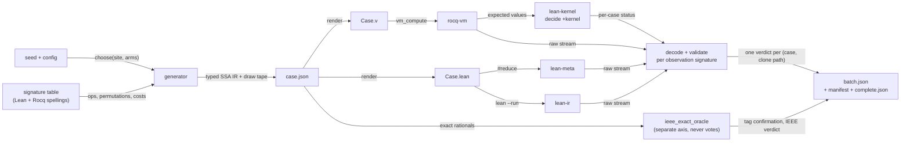

# flocqsmith: generated Flocq programs for differential conformance

**Status: first vertical slice implemented** in `scripts/flocqsmith/`
(commits `fc954bd5`, `5bb84646`, `918bbf54`), run as
`uv run scripts/run_flocqsmith.py`. It covers the BinarySingleNaN world
end to end: generation, per-case execution on all four paths, the closed
verdict taxonomy, replay, positive controls, shrinking and offline
verification. The other worlds (full-payload `B`, `W`, raw `SF` kernels,
`Fl(β)`), fix-pair campaigns and the ledger gate are still design only. The
exemplar lane (§11) is implemented separately in `scripts/flocq_exemplars.py`.
Pre-registered campaigns run from a committed descriptor
(`run_flocqsmith.py campaign`); the first two are reported in
[FLOCQSMITH_CAMPAIGN_2026-09-23.md](FLOCQSMITH_CAMPAIGN_2026-09-23.md).
Section 14 separates what has been run from what is only designed; §14.4
records where the implementation corrected this design. The
pinned identities are Flocq `7aab8f55`, Rocq 9.1.0 (`_opam/bin/coqc`), and
Lean `v4.34.0`.

flocqsmith generates small programs over Flocq's executable API that are
valid by construction. It renders each program once in Rocq and once in Lean,
runs every rendering on each execution path, and judges each case against the
pinned Rocq reference. It follows the design of
[grossmith](https://github.com/OathTech/grossmith), a Go program generator used
to test Go reimplementations against `gc`. Here the reimplementation under
test ("the clone") is FloatSpec's Lean port, and the reference is Rocq
`vm_compute` on pinned Flocq.

It also covers the question that started this work: which existing Rocq
programs use Flocq, and can they be trimmed to their Flocq-only computational
core and run on both sides? Section 11 answers it.

## Contents

1. [What this adds to the existing bridges](#1-what-this-adds-to-the-existing-bridges)
2. [Execution paths and their names](#2-execution-paths-and-their-names)
3. [Program grammar](#3-program-grammar)
4. [Value generation biased to boundaries](#4-value-generation-biased-to-boundaries)
5. [Observation protocol](#5-observation-protocol)
6. [Emitters and per-case attribution](#6-emitters-and-per-case-attribution)
7. [Closed verdict taxonomy](#7-closed-verdict-taxonomy)
8. [Replay records and campaign integrity](#8-replay-records-and-campaign-integrity)
9. [Shrinking](#9-shrinking)
10. [Positive controls](#10-positive-controls)
11. [The exemplar lane](#11-the-exemplar-lane)
12. [Capability profiles and exclusions](#12-capability-profiles-and-exclusions)
13. [Budget, timeouts and batching](#13-budget-timeouts-and-batching)
14. [Honesty ledger](#14-honesty-ledger)
15. [Build order](#15-build-order)
16. [Open questions](#16-open-questions)



## 1. What this adds to the existing bridges

`scripts/flocq_bridge.py` already drives 32 fixed test families (`OPS`,
lines 33-37), and eleven sibling `*_bridge.py` scripts cover native,
all-mode, scaling, integer rounding, remainder, model-adapter, Zaux-prelude and
Pff behaviour. Each family is a fixed
expression template filled with generated integers. Together they have
executed tens of thousands of cases (see
[THREE_VERIFICATION_LOOPS.md §11](THREE_VERIFICATION_LOOPS.md)). flocqsmith
leaves them in place as the regression base and adds five things they cannot
provide:

- **Composition.** Chains of up to about 12 operations, whose intermediate
  values have shapes that a single-operation grid never produces. Examples
  are a subnormal produced by a division and then fed to `Bfma`, and a
  signed zero produced by cancellation and then fed to a comparison.
- **Observation of every intermediate value.** Section 5 explains why
  observing only the final value is not enough; FloatSpec has already paid
  for that lesson once.
- **Generated boundary pressure across formats**, from precision 1 through
  binary16, bfloat16-shaped, binary32 and binary64, in all five modes.
  Coverage is measured per tag instead of hand-listed per family.
- **Programs taken from real Flocq clients.** Programs from Flocq's own
  `examples/` and from CompCert are trimmed to their Flocq-only cores and run
  on both sides (section 11). VCFloat, CoqInterval and LAProof were surveyed
  but are not ported yet.
- **Per-case attribution.** Today any failure, stray stderr output or timeout
  aborts the whole run (`run()` at lines 1250-1274; `main` at 1499-1502).
  That is correct for fixed families but wrong for generated programs, where
  a gap in one path must be recorded as that case's verdict and not discard
  the other 99 cases in its batch.

When flocqsmith finds a divergence, it shrinks it to a one-operation
literal-argument case (section 9). That case becomes an ordinary replay
fixture of the kind the bridges already keep (`scripts/fixtures/*Replay.json`).
The generator finds problems; the fixed families keep them fixed.

**Non-goals:**

- IEEE correctness. That is a separate axis, handled by
  `scripts/ieee_exact_oracle.py`, and it never votes on port fidelity.
- Proofs.
- Real-valued definitions, which neither system executes.
- Hardware exception flags.
- Performance.

Agreement remains finite testing, not proof of equivalence.

**Process rule, adopted from grossmith:** add no gate, meter or audit layer
without a named incident that required it. The first build is one vertical
slice (section 15). Every later gate must cite the campaign incident that
made it necessary.

## 2. Execution paths and their names

A conformance statement must name exactly what ran. The current bridge labels
do not do this:

| Proposed id | What actually runs | Current label | Notes |
|---|---|---|---|
| `rocq-vm` | `coqc`, `Eval vm_compute` on pinned Flocq | "Rocq" | The reference. Identity is the coqc sha256 and version, the Flocq commit, and the `-R` path. |
| `lean-meta` | `#reduce`, i.e. `Lean.Meta.reduce` at transparency `.all` (`elabReduce`, `Lean/Elab/BuiltinCommand.lean:459-476`; default at `Init/MetaTypes.lean:513` in the v4.34.0 toolchain source) | "kernel reduction" | This is the elaborator's reducer, not the kernel. |
| `lean-ir` | `lean --run`, the IR interpreter (`Lean/Shell.lean:34`), which calls native code for builtin and `@[extern]` symbols | "compiled" | Not a native build of FloatSpec. |
| `lean-kernel` | `example : prog = expected := by decide +kernel` | "bootstrap" | The only path that reaches the kernel. |
| `lean-native` | `lake exe` of a generated executable | not present | Later lane. It has NaN-payload and `frexp`-exceptional quotients. |
| `ieee-oracle` | exact rationals, `ieee_exact_oracle.py` | "exact oracle" | A separate verdict axis (section 7). |

These three paths are genuinely different in what they can compute.
A probe during this design (`K.lean`) reduced a well-founded definition under
`decide +kernel` and under `#reduce`, but elaborator `decide` got stuck.

**Two consequences for the existing bridge.** Both are now fixed, in
their own commits (see step 0 in §15):

1. The phrase "kernel reduction" in `flocq_bridge.py` (lines 7 and 1456) and in
   THREE_VERIFICATION_LOOPS.md (lines 356, 552, 581, 592, 987, 1037 and 1071)
   should become `lean-meta` / `#reduce`. DEMO_EXEMPLARS.md already names the
   paths correctly.
2. `bootstrap_lean` runs only when the whole batch's `lean-meta` output equals
   Rocq's (line 1490). So one mismatch removes kernel coverage for the other
   cases in the batch without saying so. flocqsmith runs `lean-kernel` for
   every case whose reference succeeded, and reports a judged count for it.

## 3. Program grammar

### 3.1 Types

Every IR value has a type, and every format-carrying type records its
parameters:

| IR type | Lean | Rocq | Notes |
|---|---|---|---|
| `BSN(p, emax)` | `BinarySingleNaN.binary_float p emax` | `BinarySingleNaN.binary_float p emax` | The first world, closed under 30 operations (§3.3). |
| `B(p, emax)` | `binary_float p emax` (full payload) | `Binary.binary_float p emax` | Operations take a NaN handler on both sides. |
| `W(mw, ew)` | `Int` word | `Z` word | Bits: b32/b64 wrappers plus the generic `mw`/`ew` facade. |
| `SF` | `StandardFloat` | `spec_float` | Raw carrier; may be non-canonical. |
| `FF` | `full_float` | `Binary.full_float` | Raw full-payload carrier. |
| `Fl(β)` | `FlocqFloat β` | `float β` | Calc/Operations world. |
| `Z` | `Int` | `Z` | Unbounded; never used in an exponent position. |
| `E` | `Int` | `Z` | Exponent-position integer, statically bounded (§4.4). |
| `Pos` | `binaryPositiveOfNat n (by decide)` or `Nat` | `n%positive` | Always drawn at least 1. |
| `Bool`, `Cmp`, `Loc` | `Bool`, `Option Ordering`, `Location` | `bool`, `option comparison`, `location` | Observers and conditions. |
| `Mode` | `.RNE .RTZ .RTN .RTP .RNA` (facade: `.mode_NE` …) | `mode_NE mode_ZR mode_DN mode_UP mode_NA` | Drawn, never computed. |

**Formats.** Every op requires `0 < p < emax`. Radix 2 is the default, and
`Fl(β)` programs also draw β ∈ {3, 5, 7, 10}.

| Class | (p, emax) | Bit shape (mw, ew) | Why |
|---|---|---|---|
| binary16 | (11, 16) | (10, 5) | Flocq has no `b16_*` wrappers, so it uses the generic `BSN`/`B` operations and generic `Bits` (verified in §14). |
| bfloat16-shaped | (8, 128) | (7, 8) | binary32's exponent range with a short precision. |
| binary32 | (24, 128) | (23, 8) | `b32_*` wrappers and generic operations. |
| binary64 | (53, 1024) | (52, 11) | `b64_*` wrappers, generic operations and the primitive-float world. |
| tiny IEEE-shaped | (3, 4), (4, 8), (8, 16) | (2, 3), (3, 4), (7, 5) | Exhaustible, and the exact oracle can bit-encode them. |
| tiny non-IEEE | (1, 2), (2, 3), (5, 7) | none | Precision 1 and emax that is not a power of two. Oracle tags are unconfirmed (§4.5). |
| raw-parameter | any integers | none | Only for raw kernels with total source domains (§3.4). |

Lean spells binary32 and binary64 as the lowercase `binary32`/`binary64` in
`Bits.lean` (`binary_float 24 128`, `53 1024`). The capitalised `Binary32` and
`Binary64` in `Binary.lean` are `Binary754 24 127` and `53 1023`, a
different emax and the permissive compatibility carrier. The renderer must
never emit them (§3.6).

### 3.2 Statements

A program is a straight-line SSA block. Its statement forms are:

- **`let v := op(args)`** where `op` is a row of the signature table.
- **`let v := select(c, a, b)`**, where `c : Bool` comes from a Flocq observer
  (`Beqb`, `Bltb`, `Bleb`, `Bsign`, `is_nan`, `is_finite`, `Bfma_szero`) and
  `a` and `b` are existing values of the same type. Lean renders it as
  `bif c then a else b`; Rocq as `if c then a else b`.
- **`let v := case4(Bcompare x y) { lt ⇒ a | eq ⇒ b | gt ⇒ c | none ⇒ d }`**,
  rendered as a `match` on `Option Ordering` / `option comparison`. It is
  designed but not yet run.
- **`branch(c) { block₀ } { block₁ }`**. Each arm is a local let-chain whose
  observation is a tagged list, `[0] ++ obs₀` or `[1] ++ obs₁`. The arms may
  have different observation shapes; the tag selects which one the decoder
  applies (§5.2). This is how the grammar tests control flow that depends on
  a comparison without forcing both arms to have the same shape.
- **`fold_k(op, acc₀, xs)`** with k ≤ 8, stored as a single fold node in the
  IR, so the shrinker can reduce k and tags can name the fold. It is rendered
  unrolled as k let-bindings. The accumulator shapes are:
  - `Bplus`/`Bmult` sums and products, starting from `+0`, `−0` or a drawn value;
  - `Bfma(acc, xᵢ, yᵢ)` dot products, the shape of LAProof's `fma_dotprod`;
  - iterated `Bsucc`/`Bpred`/`Bldexp`.

  A separate rolled rendering (`List.foldl` / `fold_left`) is a degenerate
  control (§10.3), not a test of Flocq.

**The only non-Flocq code in a generated program is glue**: `let`,
`bif`/`if`, `match` on a comparison, list append, and the observation
encoders. Every other symbol is a Flocq export on the Rocq side and its port on
the Lean side. Keeping glue this small is what lets a divergence be blamed on
the port.

### 3.3 The signature table

One Python table, `scripts/flocqsmith/table.py`, is the single source of truth.
Both renderers read it. Each row records:

- the argument and result IR types;
- the Lean template and the Rocq template, each with its own argument order;
- the proof arguments each side needs;
- the Flocq source anchor (`file:line name`);
- per-path capability (§12);
- a cost class (§13);
- whether the op is exported through the source facade.

The prototype table (30 composable BSN ops, see §14) already lists them. The
following differences have all been paid for once and are recorded as trap
rows with tests:

| Difference | Lean | Rocq |
|---|---|---|
| Format proofs | `letI : Prec_gt_0 p := ⟨by decide⟩; letI : Prec_lt_emax p emax := ⟨by decide⟩` | `p emax eq_refl eq_refl` |
| Single-proof operations | `Bnearbyint` takes only `[Prec_lt_emax]`; `Bfrexp` takes only `[Prec_gt_0]` | one `eq_refl` each: `Prec_lt_emax` for `Bnearbyint`, `Prec_gt_0` for `Bfrexp` |
| BSN `Bopp`/`Babs`/`Btrunc`/`B2SF`/`Beqb` | implicit `prec emax`, no instances | explicit `p emax`, no proofs |
| Exponent function argument order | `FLT.FLT_exp prec emin`, `FTZ.FTZ_exp prec emin` | `FLT_exp emin prec`, `FTZ_exp emin prec` |
| Calc division and square root | `Div.Fdiv β fexp …`, `Sqrt.Fsqrt β fexp …` | `Div.Fdiv fexp …`, `Sqrt.Fsqrt fexp …` (β implicit), while `Plus.Fplus β fexp …` takes β explicitly |
| Generic bits | `FloatSpec.IEEE754.Bits.Source.binary_float_of_bits mw ew (by decide) (by decide) (by decide) w` | `Bits.binary_float_of_bits mw ew eq_refl eq_refl eq_refl w` |
| NaN validity witness | `(by decide +kernel)`; elaborator `decide` gets stuck on `binaryPositiveOfNat` (`Nat.binaryRecFromOne`) | `eq_refl` |
| Positive literal | `binaryPositiveOfNat n (by decide)`, or `Nat` where the API takes `Nat` | `n%positive` |
| Radix β ≠ 2 | `instance : ValidRadix β := ⟨by decide⟩` | `Build_radix β eq_refl` |
| Rocq glue | `set_option exponentiation.threshold 5000`, `pp.deepTerms true`, large `pp.maxSteps` (all in `LEAN_HEADER`) | `Set Warnings "-deprecated"`, because Rocq prints deprecation warnings on stderr and `run()` rejects any stderr |

### 3.4 Legality: what is masked and what is only tagged

Legality has exactly three parts, as in grossmith:

1. **Typeable in both provers, under the carrier hypotheses only.** These are:
   - radix at least 2;
   - `0 < p < emax` for the Binary/BSN operations;
   - positive source mantissas;
   - a `bounded` proof for every `B754_finite` and `nan_pl` for every payload;
   - a drawn mode.

   These are the checks `Case.__post_init__` hand-codes per family
   (`flocq_bridge.py:48-122`), generalized to a type mask.
2. **Affordable** on every path within the batch budget (§13).
3. **Deterministic.** This is free for pure terms. Only `lean-native` needs
   declared quotients.

**Theorem premises are not masks.** Examples: canonical form for raw carriers;
`x ≠ 0` for `mag`/`frexp` theorems; `2^36 ≤ l` for CompCert's
`of_longu_double_2`; `prec ≥ 7` for Triangle's error bound. Inputs outside a
premise are generated deliberately, tagged `outside_theorem_domain`, and
judged for total-function correspondence only. This is the lesson of the
raw-overflow family: a harness that imposed the validity theorem's premises
on runtime inputs missed a real difference. That difference was 87 of 680
cases at seed `827419`, once the domain was expanded to nonpositive
precision (THREE_VERIFICATION_LOOPS.md §3).

**The raw-parameter lane follows from this.** Raw kernels with total source
domains are generated with unconstrained integer `(prec, emax)`, including
nonpositive precision. These kernels are `binary_round_aux`, `binary_round`,
`binary_overflow`, `shr_fexp`, `choice_mode`, `overflow_to_inf`, the
validity predicates, `shl_align_fexp` and `Fplus_naive`.

**One choice primitive.** All randomness goes through

```python
def choose(site: str, arms: Sequence[Arm]) -> Arm:
    """weight × legality mask, renormalize, one draw; records (site, bound, index)."""
```

There are no rejection loops. An empty legal set is a generator bug and
raises. "Mint a fresh value" is itself an arm, and every type has a cheap
total mint (§4.1), so a demand for a value of some type can always be met.

### 3.5 Minting values

Every type is minted only through total constructors:

| Type | Mints |
|---|---|
| `BSN` | `binary_normalize m e szero`, `Bone`, `Bmax_float`, `SF2B'` of a canonical carrier |
| `B` | `FF2B` with a literal proof, `BSN2B'`, `build_nan`, or a `B754_*` literal with `eq_refl` / `decide +kernel` |
| `W` | an integer literal |
| `Fl(β)` | a `⟨m, e⟩` / `Float β m e` literal |
| scalars | literals |

Each prover is asked to prove only facts about literal-closed terms, never
about a variable.

**Mint canonical carriers by default.** The first smoke generator (§14) drew
raw `S754_finite` leaves with a uniform mantissa. Of its 267 finite raw
leaves, 126 (47%) were non-canonical, and every one that reached `SF2B'`
became NaN. NaN then propagates, so programs silently lost coverage. So raw
`SF2B'` of a non-canonical carrier is instead a named corner
(`noncanonical_carrier`), drawn with probability of about 1/8. It is still
generated, because conversion to NaN is Flocq behaviour worth testing, but it
no longer dominates.

### 3.6 Name hygiene

Lean has noncomputable or differently typed duplicates of many Flocq names.
The renderer emits only fully qualified names from an allowlist of
namespaces:

- `BinarySingleNaN.*`
- `FloatSpec.IEEE754.BinarySingleNaN.Source.*`
- `Binary.*`
- the root `b32_*`/`b64_*`/`binary32`/`binary64` in `Bits.lean`
- `FloatSpec.IEEE754.Bits.Source.*`
- `FaithfulPrimFloat.*`
- `FloatSpec.Calc.*`
- `FloatSpec.Core.*`

It never emits:

- root declarations, such as the raw `binary_normalize`;
- `Binary32`/`Binary64`;
- `BinarySingleNaNBridge.*` and `ExperimentalBinaryRound.*`, which have been
  deleted together with the root real-rounding `Binary754` operations; the
  table test still rejects them;
- `ExperimentalSingleNaNArithmetic.*`. The one exception is
  `Ffrexp_core_binary`, which is the source-facing helper despite its
  namespace, so it gets an explicit allowlist row.

A mistaken reference fails closed: `lean-ir` reports a noncomputable
dependency, and `#reduce` output does not parse. But that would surface as a
`clone-infra-failure`, not a port gap, so the allowlist test must catch it at
table-build time. As implemented, `check_table` checks every template's head
against the namespace allowlist statically, and the live validity test runs
one program per table row on `lean-ir`, where a noncomputable head fails to
compile.

### 3.7 A rendered program, run on all four paths

The design probe for this document (§14) rendered this binary16-shaped program:

```lean
letI : Prec_gt_0 11 := ⟨by decide⟩; letI : Prec_lt_emax 11 16 := ⟨by decide⟩;
let v0 := BinarySingleNaN.binary_normalize (prec := 11) (emax := 16) .RNE (1025) (-10) false;
let v1 := BinarySingleNaN.binary_normalize (prec := 11) (emax := 16) .RNE (1) (-11) false;
let v2 := BinarySingleNaN.Bplus .RNE v0 v1;          -- constructed tie
let v3 := BinarySingleNaN.Bltb v1 v0;
let v4 := bif v3 then BinarySingleNaN.Bmult .RTP v2 v2 else BinarySingleNaN.Bdiv .RTN v2 v1;
let blk : List Int := bif v3
  then (let b0 := BinarySingleNaN.Bsqrt .RNE v2; [0] ++ standard (BinarySingleNaN.B2SF b0))
  else (let b0 := BinarySingleNaN.Bopp v2; let b1 := BinarySingleNaN.Babs b0;
        [1] ++ standard (BinarySingleNaN.B2SF b0) ++ standard (BinarySingleNaN.B2SF b1));
let v5 := BinarySingleNaN.Bfma .RNE v4 v1 v0;       -- fold_3, unrolled
let v6 := BinarySingleNaN.Bfma .RNE v5 v1 v0;
let v7 := BinarySingleNaN.Bfma .RNE v6 v1 v0;
standard (BinarySingleNaN.B2SF v0) ++ … ++ [boolean v3] ++ … ++ blk ++ … ++ standard (BinarySingleNaN.B2SF v7)
```

```coq
let v0 := @BinarySingleNaN.binary_normalize 11 16 eq_refl eq_refl mode_NE (1025) (-10) false in
let v1 := @BinarySingleNaN.binary_normalize 11 16 eq_refl eq_refl mode_NE (1) (-11) false in
let v2 := @BinarySingleNaN.Bplus 11 16 eq_refl eq_refl mode_NE v0 v1 in
let v3 := @BinarySingleNaN.Bltb 11 16 v1 v0 in
let v4 := if v3 then @BinarySingleNaN.Bmult 11 16 eq_refl eq_refl mode_UP v2 v2
          else @BinarySingleNaN.Bdiv 11 16 eq_refl eq_refl mode_DN v2 v1 in
…
```

All four paths agreed on these values:

- `v2 = [3,0,1026,-10]`. The exact sum 1025·2⁻¹⁰ + 2⁻¹¹ is a midpoint, and it
  rounds to the even neighbour.
- `v3 = 1`.
- `v4 = [3,0,1029,-10]` (rounded up).
- `blk = [0, 3,0,1025,-10]`.
- `v5 = v6 = v7 = [3,0,1026,-10]`. The fold reaches a fixed point.

Section 4.5 explains how a case earns its `tie` tag.

## 4. Value generation biased to boundaries

### 4.1 The per-format catalogue

For a format (p, emax), with emin = 3 − emax − p, every leaf draw first
chooses a class and then a representative. The classes are:

- **Zeros and infinities:** `+0`, `−0`, `+∞`, `−∞`.
- **NaN.**
  - BSN has a single NaN.
  - `B` draws a payload and sign from {1, the quiet bit alone 2^(p−2), the
    maximum 2^(p−1)−1, random}.
  - `W` draws both signalling and quiet words. The Flocq decoder does not
    quiet a signalling NaN: binary16 `0x7C01` decodes to payload 1 and
    re-encodes unchanged (§14).
- **Subnormal edges:** the minimum subnormal (m=1, e=emin), the maximum
  subnormal, and the minimum normal (m=2^(p−1), e=emin).
- **Normal grid:** 1, 1 ± ulp, powers of two near emin and near emax − p, the
  maximum finite value (m=2^p−1, e=emax−p), and random normal and subnormal
  values.
- **`W` only:** words outside the machine range (negative, and ≥ 2^width).
  Flocq's decoder input is `Z`, and its sign comparison is not machine-word
  wrapping.
- **`Fl(β)`:** mantissas with digit counts at the fexp boundary, and negative
  mantissas (`round_ZR` takes a signed mantissa).

### 4.2 Relational corners

These are constructed, not searched for. Each is an arm that builds its
operands from an already-chosen value:

- **Ties.**
  - Plus/minus: `y = ±ulp(x)/2`, with all four sign combinations.
  - Mult: odd mantissas whose product has exactly one set bit below the kept
    precision.
  - Sqrt: squared midpoints. These use the same construction as
    `round_sqrt` in the oracle.
  - Ties are generated at binade edges and in the subnormal range.
- **Cancellation:** `(x, −x)`, `(x, −x ± ulp)`, and exact-zero sums under
  every mode. The sign of an exact zero under `mode_DN` is a classic planted
  defect.
- **Overflow thresholds:** the maximum finite value plus a half-ulp, per mode.
  Also results that overflow under `ZR`/`DN` but not under `NE`.
- **Tininess:** products and quotients that land on either side of the
  minimum normal.
- **Double rounding:** an FLT result rounded again at a smaller precision, in
  odd radix (§11).
- **Exponent gap around p + 2**, the sticky-bit boundary for plus and fma. A
  far gap is available only when the budget can afford it (§13).
- **Signed-zero observers:** `Bfma_szero`, `Bsign` of an exact-zero result.

### 4.3 Weights, swarm and pairs

- **Corner rate.** Corners are drawn at about 1 in 8, following grossmith's
  calibration.
- **Swarm.** Each seed first draws a swarm subset: some operations, some
  modes and some formats. So a 200-case batch concentrates instead of
  spreading thinly.
- **Pair objective.** A forced-pair objective raises the weight of unseen
  (op, op), (op, mode) and (op, format class) pairs.
- **Frequency report.** Each run persists a per-site frequency report of
  legal versus chosen arms.

### 4.4 Integers in exponent positions

`SpecFloat.shr` is `iter_pos shr_1 d`, which runs in time linear in d on both
sides, and so does exact alignment. So every value of type `E` carries static
bounds, and `|e| ≤ 2·emax + 2·p`. `Btrunc` can return about 2^emax, so its
result has type `Z` and never flows into an `E` position. Mantissas are drawn
at least 1, because `Pos` has no zero.

### 4.5 Tags are claimed only when the construct occurred

A case declares a tag only if the construct actually occurred. This is
grossmith's "text iff use" rule.

- **Structural tags** (`select`, `branch`, `fold_k`, `raw_param`) come from
  the IR.
- **Numeric tags** (`tie`, `subnormal_result`, `overflow`, `exact_zero_sum`,
  `nan_payload`) are confirmed after the run. For IEEE-shaped formats,
  `ieee_exact_oracle.Format(mw, ew)` is already generic. Its `FORMATS` table
  holds only 32 and 64 today, so 16, bfloat16-shaped and the tiny formats
  are one-line additions.
- **Non-IEEE formats** get tags from IR-level reasoning only, and those tags
  are marked `unconfirmed`.

The smoke prototype counted "operations used" by the first token of the
rendered text, so literals like `(-9` were counted as operations. That is the
error this rule prevents. Features are counted from the IR.

## 5. Observation protocol

### 5.1 Observe every binding

Every SSA binding's value is encoded and observed, not only the final one.
There are two reasons:

1. **A later stage can hide an earlier divergence.** In the raw-overflow
   incident, the exact full-float embedding already enforced a positive
   mantissa, so the final stage agreed even though the earlier raw stages did
   not (THREE_VERIFICATION_LOOPS.md §3). That is why that family keeps every
   stage.

   Generated chains make the same thing systematic:
   - a wrong signed zero disappears after adding a nonzero value;
   - a wrong sticky bit or location is absorbed by later rounding;
   - a wrong payload is erased by `B2BSN`;
   - a wrong comparison only redirects a `select`.
2. **The first divergent binding locates the defect.** The shrinker uses it
   (§9).

Observing everything also keeps Lean's output parseable. An unobserved `let`
triggers the unused-variable linter, whose `warning:` lines appear in the
stdout stream that the parser reads. The API probe output (§14) contains
exactly these warnings. As a second guard, flocqsmith's Lean header sets
`linter.unusedVariables false`; the bridge's `LEAN_HEADER` does not set it
today.

### 5.2 Wire format and typed decoding

The wire format stays `List Int` per case, because both provers print
integers cheaply and `parse_result` already normalizes `Int.ofNat` and
`Int.negSucc`. Its meaning comes from an **observation signature** that the
generator declares for each case:

```json
{"schema": "flocqsmith-observation-v1",
 "case": "s17-000042", "subject_sha256": "…",
 "bindings": [
   {"id": "v2", "type": "BSN", "p": 11, "emax": 16, "encoder": "standard"},
   {"id": "v3", "type": "Bool", "encoder": "boolean"},
   {"id": "blk", "type": "branch", "arms": [
      [{"id": "b0", "type": "BSN", "p": 11, "emax": 16, "encoder": "standard"}],
      [{"id": "b0", "type": "BSN", "p": 11, "emax": 16, "encoder": "standard"},
       {"id": "b1", "type": "BSN", "p": 11, "emax": 16, "encoder": "standard"}]]}]}
```

**Encoders.** These reuse `LEAN_HEADER`/`COQ_HEADER` in `flocq_bridge.py`:

| Encoder | Output |
|---|---|
| `standard` | `[kind 0 zero / 1 inf / 2 nan / 3 finite, sign, m, e]` |
| `full` | as `standard`, with the NaN payload in the m slot |
| `bits` | one word |
| `boolean` | 0 or 1 |
| comparison | −1, 0 or 1, with 2 for `None` |
| `located` | 2 integers |
| `triple` | 3 integers |
| `floating` | `[Fnum, Fexp]` |
| `fields` | `[s, m, e]` |
| `Z` | `[z]` |
| `N` | Lean `Nat` and Rocq `Z.of_N` |

Lean's `Binary.B2FF` returns `FullFloat` with a `Nat` payload, so it needs its
own encoder. `Binary.B2FF_exact` returns `full_float`.

**Structure is checked before meaning.** Each path's document is validated
against the signature before any comparison. Any of the following makes the
document invalid:

- wrong total arity;
- a constructor tag outside 0..3;
- a sign outside {0, 1};
- a finite mantissa ≤ 0, or ≥ 2^p for a `BSN`/`B` value;
- a NaN payload that violates `nan_pl`;
- a location outside 0..3, or a comparison code outside {−1, 0, 1, 2};
- a branch tag outside {0, 1}, or an arm arity that does not match its tag;
- truncated output (the `⋯` marker).

An invalid document is a `harness-error` or `clone-infra-failure` (§7), never
a match.

**Comparison** is strict equality of the decoded, typed values. The report
records the first divergent binding in program order, as well as the whole
vector. The `--nan-policy` option is `exact` by default for the pure prover
paths. `kind` (all NaNs equal) exists only for the later `lean-native` lane,
where IEEE leaves payload choice open. It is a declared projection, not
silent blindness.

## 6. Emitters and per-case attribution

One batch produces one `.v` file and one or two `.lean` files, as today. What
changes is that each case gets its own status.

### 6.1 Rocq (`rocq-vm`)

`COQ_HEADER` plus `Set Warnings "-deprecated"`, then one command per case:

```coq
Ltac run_case t := first [ timeout T (let v := eval vm_compute in t in idtac "OK" v)
                          | (let _ := constr:(t) in idtac "TIMEOUT") ].
Goal True.
idtac "case_0"; run_case (…program 0…).
idtac "case_1"; run_case (…program 1…).
Abort.
```

This was re-run for this document. The output was `case_0 / OK 42`, then
`case_1 / TIMEOUT` for `Z.pow 3 (Z.pow 2 40)`, and coqc kept running
afterwards.

A type error still aborts the file, because the term is interpreted before
the tactic runs. Under construction that is a generator bug. The last
`case_k` marker names the case, the batch fails closed as `harness-error`,
and later cases are not judged. Plain `Fail` is unsuitable: its messages are
silent under coqc, and it aborts when the command succeeds. A per-case
`Redirect "case_k" Timeout T Eval vm_compute in …` also works, and writes
one file per case.

### 6.2 Lean `#reduce` (`lean-meta`)

Each case is its own `#reduce` command at a known line range in one file,
run as `lake env lean --json`. Every message carries a position, a severity,
and sometimes a typed `kind`. For example, a failed instance produced
`lean.synthInstanceFailed._namedError` (re-run for this document).

**Hazard, observed:** the failed `#reduce` still emitted an `information`
message (`?m.6.1 1 true`) after its error. So any error-severity message in a
case's range decides that case before its information output is read.

The header's global `maxHeartbeats 100000000` is replaced by a deterministic
per-case `set_option maxHeartbeats N in`. Exhausting it is a
`clone-infra-failure(heartbeats)`, not a timeout.

### 6.3 Lean interpreter (`lean-ir`)

`main` prints one line per case, `k␠[…]`, and flushes. Before each case it
writes `BEGIN k` to stderr. The reason is that `panic!` in Lean does not
abort: it prints to stderr and returns a default value, so stdout would look
plausible. Stderr text between the `BEGIN` markers therefore turns that
case's verdict into `clone-infra-failure(ir-panic)`, whatever its stdout
says.

If the process crashes, for example from stack overflow, every case after
the last printed line is re-run once, each in its own process, and the
crashing case gets `ir-crash`. That bounded re-run is the only retry anywhere
in the harness, and it is recorded.

### 6.4 Lean kernel (`lean-kernel`)

For every case whose `rocq-vm` status is OK, the harness emits
`example : (prog : List Int) = <rocq values> := by decide +kernel` with
`--json`. This does not depend on agreement on `lean-meta`.

Outcomes:

- No message: match.
- A `decide` rejection (kind `[anonymous]`, one of two pinned prefixes): the
  case is re-checked in a second process with the negated statement,
  `example : ¬ ((prog : List Int) = <rocq values>) := by decide +kernel`.
  The kernel proving the negation is `observation-mismatch`; rejecting both
  is `clone-infra-failure(kernel-stuck)`.
- A typed runtime error: `clone-infra-failure(heartbeats | max-recdepth | …)`.
- Anything else: `harness-error`.

The re-check exists because the rejection text is not a kernel verdict (§14.4):
when the kernel rejects the proof, Lean diagnoses with elaborator reduction
and prints "proved that the proposition … is false" only if *that* reduction
reaches `isFalse`, and "failed for proposition … did not reduce" otherwise.

### 6.5 Reuse of `flocq_bridge.py`

flocqsmith imports the bridge as a module, as the prototype did, and does not
copy it. It reuses:

- `configured_coqc`, `verify_reference` (gitlink pin, clean `src`, no
  untracked `.v` files);
- `lean_source_fingerprint` / `require_lean_source_snapshot`;
- `LEAN_HEADER`, `COQ_HEADER` and their encoders;
- `small_ieee_raw`;
- `parse_result`'s integer normalization;
- the rule that the output directory must be empty (line 1445);
- `run`'s process-group kill.

`run` raises on any stderr output or nonzero exit. flocqsmith needs a
sibling that returns `(stdout, stderr, returncode, timed_out)` for
classification. As implemented it is `flocqsmith/process.py:run_capture`,
which repeats `run`'s process-group kill and leaves `flocq_bridge.run`, its
contract and its tests at `test_flocq_bridge.py:19-48` untouched.

Generated `.v` files never go inside the reference checkout, because
`verify_reference` rejects untracked `.v` files there. Lean sources must not
change during a run.

## 7. Closed verdict taxonomy

Each (case, clone path) pair gets exactly one verdict. The clone paths are
`lean-meta`, `lean-ir` and `lean-kernel`, and each is judged against `rocq-vm`:

| Verdict | Meaning |
|---|---|
| `match` | Both documents are valid and the decoded values are equal. |
| `observation-mismatch` | Both documents are valid and the values differ. The first divergent binding is recorded. |
| `reference-infra-failure` | Rocq timed out on this case. Its output is never compared. |
| `clone-infra-failure(stage)` | The Lean path failed on this case. `stage` comes from a closed set: `lean-elab:<kind>`, `noncomputable`, `meta-stuck`, `heartbeats`, `max-recdepth`, `ir-panic`, `ir-crash`, `kernel-stuck`, `timeout`. |
| `both-infra-failure` | Both of the above. |
| `harness-error` | A generator or harness defect: a Rocq type error, an invalid document, an unknown message class, or a signature/arity mismatch. |

**Rules:**

- **Join by identity, not position.** Cases are joined by `(case id, subject
  sha256)`, never by list position.
- **Validate before classifying.**
- **Typed stages.** A stage comes from JSON `kind` or from a tested prefix
  table, never from free-text matching. grossmith's audit found and removed
  exactly that failure.
- **Separate counts.** Generated, judged and caught are separate numbers. For
  each path, `generated = judged + excluded(capability)`, and every exclusion
  is named (§12).

**`lean-meta` and `lean-ir` disagreeing with each other** is reported even
when one of them matches Rocq. That points to an `implemented_by`, `extern`
or `csimp` override (inventoried by `scripts/check_compiled_trust.py`) or to a
compiler issue, not to Flocq.

**The oracle axis is separate.** `ieee-oracle` gives its own closed verdict on
each binding it can model: `holds | violated | not-applicable(premise) |
oracle-error`. The exemplar self-checks in §11 use the same set.
Lean ≡ Rocq ≢ oracle is a question about Flocq, about the oracle, or about an
out-of-premise input. It is never a port bug, and it never changes a
differential verdict.

**What a campaign reports** (its conformance statement):

- reference identity and each path's identity;
- seed range, N, and policy (`nan-policy`, budget, profile);
- the verdict histogram per path;
- the tag coverage histogram with generated/judged counts;
- the first divergent binding of each mismatch.

## 8. Replay records and campaign integrity

### 8.1 Case records

Each case writes a `case.json`:

```json
{"schema": "flocqsmith-case-v1", "id": "s17-000042", "seed": 17,
 "generator_rev": "<sha256 of scripts/flocqsmith/** + table>",
 "config": {"formats": ["b16", "t3_4"], "swarm": ["Bplus", "Bfma", "Bltb"],
            "corner": "tie", "profile": "default", "budget_ms": 400},
 "ir": {…typed SSA…}, "observation_signature": {…},
 "lean_sha256": "…", "rocq_sha256": "…",
 "tags": ["tie", "select", "fold_3"],
 "draws": [["leaf.class", 11, 4], ["op", 23, 7], …]}
```

Each draw records `(site, bound, value)`, not only the value. Replay
(`--replay case.json`) regenerates both renderings from the tape plus a
compatible generator revision, and verifies both hashes. A tape that runs
out, has a value out of range, or has values left over produces a typed
`ReplayError`. A nonpositive bound is a generator bug, so blame is never
shifted onto the tape.

A **mutated-tape sweep** proves this seam before any shrinker exists: every
mutated tape must either decode to a valid program or be rejected with a
typed error. No third outcome is allowed.

Shrunk programs have no tape. They are replayed from `ir`, which both
renderers accept directly. Minimized findings are committed as
`scripts/fixtures/flocqsmith/replays/*.json` IR fixtures, and the conformance runner
replays them, as it does the `*Replay.json` files today. None exists yet.
`scripts/test_ci_coverage.py` rejects a JSON fixture below `scripts/fixtures/`
until a CI step replays it, so the first one must land with that step. Campaign
descriptors and reports are records, not fixtures, and live in
`FloatSpec/docs/flocqsmith/`.

### 8.2 Campaign integrity

Each rule below closes a gap in the current bridge (§14):

- **Staging and atomic publish.** Build in `<out>.staging/` and publish with an
  atomic rename. `report.json` is not rewritten in place.
- **Manifest.** Digest every generated `.v`/`.lean`, every retained raw output
  stream and every `case.json`.
- **Completion record.** Write `complete.json` last. It binds the report
  digest to the manifest digest.
- **Binary identity by digest.** Record `coqc` and Lean by sha256 and version,
  not by resolving them through `PATH`, elan or `LEAN_TOOLCHAIN_OVERRIDE`.
- **Dirty trees.** Refuse a dirty tree unless `--allow-dirty` is given, and
  record the dirty content hash.
- **Offline `--verify`.** Re-parse the retained raw streams, re-judge every
  verdict and recompute every aggregate. This is possible because the bridge
  already keeps raw `.out` files. Input integrity and report consistency are
  checked separately.

## 9. Shrinking

Following grossmith, the shrinker is built only after the first real
finding. The seam it needs (IR replay, first divergent binding) is designed
now. The approach is delta debugging on the SSA block, with one
FloatSpec-specific pass:

**Predicate.** The shrink target is "same verdict class on the same path, and
the first divergent binding is the same op". A step that turns the case into
a different mismatch is rejected, so the shrinker cannot drift from one bug
to another.

**Passes, in order.** Each round renders a batch of candidate programs, one
process per path, which costs roughly one batch.

1. **Cut after the first divergence.** Later bindings are observed separately
   and cannot matter, so they are deleted.
2. **Pin values.** Replace a binding with a literal mint of its *reference*
   value, which is known because every binding is observed. Any prefix of the
   program can then be removed without changing the diverging op's inputs.
   Usually this pass alone produces a one-op program with literal arguments.
3. **ddmin** over the remaining bindings outside the backward slice.
4. **Simplify operands.** Replace each argument with a simpler catalogue value
   (0, 1, the minimum subnormal, a power of two) while the predicate holds.
5. **Descend formats.** Move to the smallest format where the op signature
   and the divergence survive, down to the tiny formats, which are cheap to
   check exhaustively.
6. **Canonicalize the mode** toward `NE`, and flatten structure: a `select`
   becomes its taken arm, and a fold's k decreases.

The output is the minimized IR, both renderings, the step log, and a
candidate fixed-family case for `flocq_bridge.py` when the op has one.

## 10. Positive controls

"0 mismatches" means nothing until the same pipeline has been shown to
detect planted defects. Every control is applied to a **temporary copy** of
a Lean-side template, encoder, or generated wrapper file in the batch
folder. `FloatSpec/` is never edited, because a planted defect in real
source could be committed or left in a build. The existing precedent is
`test_flocq_bridge.py:477-542`: it uses `patch.object(bridge, 'expressions', …)`,
requires each replacement string to occur exactly once, and asserts that the
mismatch appears on both Lean paths and only in the expected columns.

**As implemented (2026-09-23).** `scripts/flocqsmith/mutants.py` has 13
controls. Three change an encoder or the renderer: the BSN encoder flips
the sign of finite values, the Boolean encoder is negated, and the renderer
swaps UP and DN. Ten are planted semantic defects. Five of them are §10.2
families: tie handling (`tie_rne_as_rna`), mode dispatch
(`updn_swap_negative`), the ZR overflow result (`zr_overflow_to_inf`), the
FLT emin clamp (`subnormal_exp_off_by_one`) and `Bsucc` at the maximum
(`succ_max_saturates`). The other five are `dn_zero_sign`,
`fma_double_rounding`, `ltb_as_leb`, `trunc_floor` and
`nearbyint_na_as_ne`. A control is a Lean rendering
policy; its wrappers are written into the preamble of the generated Lean
files, never into a copied table or under `FloatSpec/`.

The rest of this section is still design only:

- the other §10.1 mutations (mantissa or exponent ±1, zero ↔ finite,
  payload dropped, `lt ↔ gt`, RNE ↔ RNA in the renderer, reordered
  observations and a changed format parameter);
- the requirement-driven control pool;
- two §10.2 families: the Calc `truncate` location defect, and NaN operand
  selection, which needs the unimplemented `B` world;
- a declared bound on cases to first detection. Reports record that
  number, but the live test only requires at least one detection;
- degenerate clones (§10.3) and fix-pair campaigns (§10.4).

### 10.1 Encoder and renderer shape matrix

Mutate one Lean encoder or template in a temporary copy of the table. The
mutations are:

- sign bit flipped;
- mantissa ± 1;
- exponent ± 1;
- zero ↔ finite constructor;
- payload dropped;
- `lt ↔ gt` location or comparison;
- Boolean negated;
- mode swapped (`RTP ↔ RTN`, `RNE ↔ RNA`);
- two binding observations reordered;
- a format parameter in the type changed.

**Requirements:**

- Every replacement must apply exactly once.
- Each control must produce `observation-mismatch` on at least one case.
- A control must never produce an infrastructure or harness verdict, and the
  unmutated table must stay all-`match`.

The control pool is requirement-driven. A seed is kept only if it exercises
an unmet shape: a subnormal result, a tie, −0, overflow to ∞ under `UP`, a
NaN with payload, a non-canonical carrier, a taken and a not-taken branch.
A missing shape fails loudly by name.

### 10.2 Planted semantic defects

A generated `FlocqsmithMutants.lean` in the batch folder wraps a real
function, and for that op only the renderer points the Lean side at the
wrapper:

```lean
-- Sketch (helper names illustrative). Generated in the batch folder only;
-- never under FloatSpec/.
def Mutant.Bplus (m : RoundingMode) (x y : BinarySingleNaN.binary_float p emax) :=
  let r := BinarySingleNaN.Bplus m x y
  if m == .RTN && isZero r then BinarySingleNaN.Bopp r else r   -- exact-zero sign under DN
```

Each rounding family gets one planted defect:

- tie handling (`RNE` answered as `RNA`);
- mode dispatch (`UP`/`DN` swapped for negative results);
- the overflow result under `ZR`;
- the FLT emin clamp (subnormal exponent off by one);
- sticky/location (`lt ↔ gt` in a Calc `truncate` path);
- NaN operand selection (first ↔ second in a `B` handler);
- `Bsucc` at the maximum finite value.

Each mutant must be detected within a declared number of generated cases,
and the report records cases-to-first-detection. The order in which mutants
are detected is itself information about the generator. These controls
measure whether the generator can *reach* a condition, not the port.

### 10.3 Degenerate clones

Each pair below must agree 100%, with no declared quotient:

- `rocq-vm` against Rocq `Eval cbv` / `lazy`;
- `lean-meta` against `lean-ir` against `lean-kernel`;
- a rolled fold against its unrolled rendering;
- the `Source.*` spelling of an op against its core spelling (the prototype
  already draws between them at random).

A disagreement in any pair is an adapter or toolchain finding.

### 10.4 Fix-pair campaigns

These replay FloatSpec's own history: the same generated corpus runs against
a pre-fix and a post-fix commit. Each pre-fix tree is a temporary
`git worktree add <tmp> <fix>^`. The current tree is never checked out
backwards, and only the affected modules are rebuilt.

The commits below each changed Lean source together with the fixture that
recorded the counterexamples:

| Historical defect | Fixed in | Original evidence |
|---|---|---|
| raw overflow at nonpositive precision | `b5be023a` | 87/680, seed `827419` |
| signed shift in `ieee_round` | `fa8757ef` | 197/6,354, seed `826411` |
| SingleNaN validity at the raw boundary | `ba3e2a8b` | 240/1,180, seed `860213` |
| `valid_binary_SF` always true | `e28a1beb` | 3 of a 5-case red corpus |
| raw `prim_comparison` of (3,−1) vs (6,−2) | `83b0ca02` | `PrimitiveComparisonReplay.json` |
| `prim_conversion` wrapping / double rounding | `c4f0d85f` | 4 cases, `PrimitiveConversionReplay.json` |

For each pair the report gives flips and cases-to-first-detection. Each pair
must first be confirmed by replaying its fixture on the parent commit.

If generation fails to detect an in-grammar defect, that is a generator gap,
and it is recorded in the ledger. grossmith found a whole blind spot in its
grammar (bare calls) this way.

## 11. The exemplar lane

This section answers the original question: take real Rocq programs that use
Flocq, trim them to Flocq, and run both sides.

### 11.1 Sources

| Source | Commit | License | Computational core |
|---|---|---|---|
| Flocq `examples/` | `7aab8f55` | LGPL-3.0+ | `Compute.v` is the only file with executable definitions (plus/mult/sqrt/div, parametric in β, fexp and choice). The others are proofs over R and become executable through `Compute.v` (§11.2). |
| CompCert `lib/IEEE754_extra.v`, `lib/Floats.v` | `bd2b382` | LGPL-2.1+ and INRIA non-commercial | Conversions (`BofZ`, `ZofB`, `Bconv`, `Bparse`, `of_int(u)`/`of_long(u)`, `to_int(u)`/`to_long(u)`, `of_single`/`to_single`, `exact_inverse`), NaN-payload policies, and proven executable identities. It vendors Flocq 4.2.2, file-identical to the pinned `src` except that it omits PrimFloat and Pff. |
| VCFloat | `4106d7c` | LGPL-3.0+ | `Float_notations.v` (decimal ⇄ `binary_float` at any width); 18 FPBench binary64 kernels with input ranges and proven round-off bounds; a binary32 leapfrog step |
| CoqInterval `src/Float/Generic.v` | `f94b134` | CeCILL-C | A proof-free, independent multi-radix rounded arithmetic built on Flocq's Zaux/Digits/Bracket, which gives a third implementation |
| LAProof `accuracy_proofs/*_model.v` | `f47d831` | MIT | `dotprodF`, `fma_dotprod`, `sumF` (from −0), Cholesky, forward/backward substitution |

FloatSpec is Apache-2.0, so no trimmed third-party code is committed as if it
were FloatSpec's. Each exemplar ships as a **trim manifest** instead. The
manifest records the upstream URL and commit, the file and line ranges kept
verbatim, and every replacement:

- `Integers.int` → `Z` mod 2ⁿ;
- `Archi` → a generator parameter;
- R-valued `round ∘ op` → the corresponding `Compute.v` float op;
- `Decimal` → integer triples.

A re-extraction script fetches the pinned commit, applies the manifest, and
fails closed if the upstream text has drifted. Trimmed text lives only in the
batch folder, or in an isolated fixture directory that keeps its original
headers.

**As implemented (2026-09-22).** The eight exemplars in
`scripts/fixtures/exemplars/` take the second option. The trimmed text is
committed there with its upstream header and licence. The README's "Trim
manifests" section records in prose what was kept verbatim and what was
replaced. There is no re-extraction script. Only `Compute.v` is checked byte
for byte against the pinned upstream file, so the other trims could drift
from upstream without any check noticing. Whether committing the
CompCert-derived text is acceptable is still open question 2 (§16). VCFloat,
CoqInterval and LAProof in the table above are surveyed, not ported.

### 11.2 Seeds, in order

1. **`Compute.v` plus Cody–Waite `cw_exp`** on binary64 (FLT −1074 53, NE).
   Also `nearbyint` as FIX_exp 0. Oracle: relative error ≤ 2⁻⁵¹ on
   [−746, 710], checked with exact rationals.
2. **CompCert Floats identities.** Examples: `of_long_from_words`,
   `of_longu_decomp`, `div_mul_inverse`, `cmp_swap`, and the round-to-odd
   `of_long(u)_double_1/2`. The NaN flow is run with `Archi` ∈ {x86_64,
   aarch64, riscV}. Premise guards are required: `of_longu_double_2` really
   does "fail" at `l = 1`, where its premise `2³⁶ ≤ l` is false.
3. **`Division_u16`.** The axiom `frcpa` becomes a model (RN/RD/RU of 1/b to
   11 bits) in the 64-bit register format FLT(−65597, 64). The oracle
   `div_u16 a b = a / b` checks itself.
4. **`Sqrt_sqr` §6**, the exhaustive radix-5 precision-3 check. Also odd-radix
   double rounding (radix 3/5/7, all choice pairs, FLX/FLT/FTZ). Here
   `round_p ∘ round_p' = round_p` is an executable equality.
5. **VCFloat parse/print round-trip** at every width, plus the FPBench
   kernels. Bounds maps give input ranges, and proven round-off bounds give
   exact-rational oracles.
6. **The CoqInterval `Generic.v` trim** for three-way agreement against
   `Compute.v` and FloatSpec.

After these come LAProof folds (these map directly onto `fold_k`) and
Homogen `orient2d`/`incircle2d`. Homogen's certified bound literals can be
recomputed with `Operations.Fplus`/`Fmult`, which also tests very large
mantissas.

### 11.3 How exemplars run

The Rocq trim compiles against pinned Flocq in a temporary directory:

```sh
coqc -q -R /path/to/pinned-flocq/src Flocq Exemplar.v
```

It is never compiled inside the reference checkout. The Lean side is a
transliteration over FloatSpec's API, and it is **client code, not the
port**, so the harness classifies a shim divergence as `harness-error` until
it has been triaged.

A concrete trap from the Cody–Waite draft shim: the Rocq line
`Fnum k * Z.pow 2 (Fexp k)` was transliterated as
`k.Fnum * 2 ^ k.Fexp.toNat`. For a negative exponent, Rocq gives
`Z.pow 2 (−1) = 0`, while Lean gives `2 ^ 0 = 1`. It happened to be harmless
there only because FIX_exp 0 keeps `Fexp k ≥ 0`.

Shims therefore follow three rules:

- call the Lean port of the Rocq function the exemplar calls, never ad hoc
  Lean arithmetic;
- use the §3.6 name allowlist;
- have no `Fnum`/`Fexp` arithmetic outside ported functions.

Deriving choice functions from `Compute.v`'s `rnd_choice` hypothesis
prevents a second trap. Guessing them fails, because `round_ZR` takes a
*signed* mantissa, so in sign-magnitude form the ZR choice is just `m`. An
early CoqInterval comparison hit exactly this bug.

Every exemplar gets two verdicts:

- a differential verdict, `lean-*` against `rocq-vm`, on every intermediate
  value;
- its self-check oracle on each side separately (`holds | violated |
  not-applicable(premise) | oracle-error`).

### 11.4 Exemplars as grammar seeds

Where an exemplar's operations fall inside the op vocabulary, it is imported
as IR, and the generator mutates around it. It swaps constants for catalogue
boundaries, changes format and mode, and lengthens folds. Every exemplar
depends on `Compute.v`, so porting it into FloatSpec proper (for example
`FloatSpec/src/Calc/Compute.lean`, with its four correctness theorems stated
against `Calc.round`) would replace a client shim with a reviewed,
source-anchored module. That is a separate decision (§16).

## 12. Capability profiles and exclusions

A profile can only **remove** capability. It is applied at generation time,
so an excluded construct is never emitted instead of being emitted and then
failing. Unexpected gaps still surface as `clone-infra-failure(stage)` and
never as false matches.

| Path | Profile |
|---|---|
| `rocq-vm` | No real-valued definitions. |
| `lean-ir` | No `noncomputable` or `Classical` definitions. Honours `implemented_by`, `extern` and `csimp`; those overrides get targeted generation (§7). |
| `lean-meta` | Proofs are skipped. It may get stuck on irreducible or well-founded definitions, which is recorded as `meta-stuck`. |
| `lean-kernel` | Needs `Decidable (List Int = List Int)` and affordable reduction (§13). |
| `lean-native` | Later lane. It has the declared quotients `{nan_payload, frexp_exceptional}` (the hardware exponent 0 against the model's −2101; THREE_VERIFICATION_LOOPS.md §5). |

**Excluded on the Lean side, and why.** The design rule is to exclude any
operation the Lean side cannot yet execute, and list it here. On 2026-09-22
there were no Flocq-executable exports of that kind in Binary, BinarySingleNaN,
Bits, PrimFloat or Calc. A 40-group probe found every one executable under
`#eval` and `#reduce`, matching Rocq (§14). The exclusion list is therefore
about names and domains:

| Excluded | Reason | Side |
|---|---|---|
| `B2R`, `SF2R`, `FF2R`, `Round.round`, `round_mode`, `inbetween_*`, `Zrnd_FTZ` | Real-valued or `Prop`. Not executable on either side. | both |
| `negligible_exp` | Uses LPO. | both |
| Flocq `examples/Compute.v` | Not ported. Runs only as a client shim (§11). | Lean |
| Root declarations, `Binary32`/`Binary64`, `ExperimentalSingleNaNArithmetic.*` (except `Ffrexp_core_binary`) | Differently typed duplicates (§3.6). The noncomputable root `Binary754` ops, `BinarySingleNaNBridge.*` and `ExperimentalBinaryRound.*` have been deleted. | Lean |
| `Bldexp`/`shr`/`binary_normalize` with an exponent argument beyond `2·emax + 2·p` | Budget: the cost is linear in the argument on both sides. | both |
| Native hardware floats | Deferred to `lean-native`. | Lean |

The ledger (§14) re-derives this table mechanically from the port inventory
and a compile-once check of every table row, and fails if they disagree. This
section is not the source of truth.

**First additions.** About 40 APIs are executable on both sides, matched
once in the probe, and have no bridge driving them. They enter the op table
first:

- BSN `Bopp`/`Babs`/`erase`, the predicates, `Bfma_szero`, `Bmax_float` and
  `Bnormfr_mantissa`;
- `choice_mode`, `overflow_to_inf`, `binary_fit_aux`, `shl_align_fexp`,
  `Fplus_naive` and `Ffrexp_core_binary`;
- Binary `get_nan_pl`/`build_nan`/`BSN2B'`/`lift`/`nan_pl`, `SF2FF` and the
  `*_FF` helpers;
- generic `Bits.binary_float_of_bits` and its siblings;
- Calc `truncate_FIX`;
- Core `Zfast_*`, `iter_nat`, `Zscale`, `Zslice`, `Zsum_digit`, `Zdigit` and
  `Zdigits_aux`.

## 13. Budget, timeouts and batching

A timeout is not a comparable outcome, so programs are priced when they are
emitted, not measured afterwards. grossmith's closed-form worst-case formula
failed three times for the same reason: it read a static figure at emission
that execution later changed. So flocqsmith charges each emission as it
happens.

### 13.1 Cost model

**Static bounds.** Every IR value carries static bounds: mantissa bits ≤ p,
and an exponent interval. These are exact at emission, because formats and
literals are known and the op semantics bound the result.

**Per-op cost.** Each op charges `cost(op, path, class)`. The class is
`normal`, `subnormal`, `huge`, or `far` together with the exponent gap. The
prototype's per-command Lean profiler times, with import excluded, were:

| Operation (binary64) | `lean-meta` ms | `lean-kernel` ms |
|---|---|---|
| every other measured op and class (26 ops: `b64_*`, `Binary.*`, BSN, primitive-float; classes normal / subnormal / huge / far) | 3–59 | 1–41 |
| `b64_plus`, BSN `Bplus`, `Prim.add`, far operands (gap ≈ 2,000 bits) | 540–899 | 964–1,300 |
| `b64_fma`, BSN `Bfma`, far / subnormal / huge | 238–257 | 297–321 |

Plus and fma cost roughly 0.25–0.65 ms per bit of exponent gap.

**Fixed costs.** Each process costs about 3–5 s for a Lean import and
0.3–0.5 s for Rocq. The printing cost of the observation is charged too,
since grossmith's audit found it missing from their budget.

**Folds and branches.** Folds multiply their body cost by k. A branch charges
its more expensive arm.

**Masking.** An arm the remaining budget cannot afford is masked, so extreme
tapes degrade to cheap arms. For example, a raw plus across a huge gap
becomes a rounded op or a normalized mint. Already-committed structure keeps
a floor liability, so it always remains payable.

**Witness.** A sweep of maximum-growth tapes, executed and timed against the
ceiling, verifies the model.

### 13.2 Batches and backstops

- **Batch size by cost.** A batch is filled up to predicted cost, not up to a
  fixed count. The target is 40–60 s per path, so the existing 120 s process
  timeout holds under load swings. This generalizes `BATCH_LIMITS`
  (`flocq_bridge.py:1386-1390`), which was set after a 200-case primitive
  batch exceeded 120 s.
- **Per-case backstops.** Lean uses `maxHeartbeats` per case (deterministic).
  Rocq uses the Ltac `timeout` (wall clock), so a Rocq timeout is always
  `reference-infra-failure` and never compared.
- **Concurrency.** A semaphore allows at most two heavy prover processes at
  once by default. `flocq_bridge.execute` uses three workers; that is fine in
  CI but not on a shared development machine.
- **Measured.** The 150-program smoke campaign (size 10) took 41 s for all
  three paths plus kernel regressions. The two-program design probe took
  0.46 s for Rocq, 4.25 s for `#reduce`, 4.89 s for `--run` and 5.15 s for
  kernel, almost all of it import.

**Sharing is safe.** A depth-32 chain in which every value is used twice
(`a_{i+1} := Bplus a_i a_i`) ran in under 20 ms under both `#reduce` and the
kernel. So programs may be DAGs without blowing up exponentially.

## 14. Honesty ledger

### 14.1 Status of the claims in this document

| Claim | Status |
|---|---|
| BSN generator (36 table rows, 10 formats, op/select/case4/fold/branch, 10 relational corners), per-case harness on four paths, closed verdicts, replay and mutated-tape sweep, 13 positive controls, shrinker (flatten, cut, pin, simplify, mode), staging/manifest/`complete.json`, offline `verify` | **Implemented and run** (§14.4). 38 tests in `scripts/test_flocqsmith.py`, 6 of them live. |
| Worlds `B`, `W`, raw `SF` kernels, `Fl(β)`; raw-parameter lane; fix-pair campaigns; degenerate clones (§10.3); ledger and gate; `lean-native`; format descent in the shrinker | **Not implemented.** Design only. |
| Pre-registered campaigns agree (descriptor-driven, 2026-09-23) | **Observed**, twice. Descriptors committed before each run (`a26c90a6`, `c6c91837`), clean trees: 2,360 programs over 20 lanes on distinct seeds, all 10 formats, 36 ops, 11 op families per format, 6 forms, 5 modes, 10 corners; 2,360/2,360 `match` on `lean-meta`, `lean-ir` and `lean-kernel` (50,881 observed value bindings and 616 branch tags per path); no mismatch, no infrastructure or harness verdict, so nothing to cluster or shrink. All 13 controls detected on all three paths on both fresh control seeds; exemplar lane test 29/29 with none skipped; every lane re-judged offline. See [FLOCQSMITH_CAMPAIGN_2026-09-23.md](FLOCQSMITH_CAMPAIGN_2026-09-23.md). |
| Composed BSN programs agree (implemented generator) | **Observed once.** Seed `20260922`, 50 programs at `68f3de8a` (clean tree): 50/50 `match` on `lean-meta`, `lean-ir` and `lean-kernel`; 3,203 observed integers per path; all 36 ops; 20 s. Reference-side tags: 66 ties (13 under NE), 51 inexact, 24 exact zero sums, 32 overflow-range and 22 subnormal-range results, 31 NaN results. `verify` re-judged all 50. |
| Every positive control is detected | **Observed** (deterministic live test). Seed 5, 40 programs, control-focused corpus: all 13 detected on all three Lean paths with no infrastructure or harness verdict and an all-match baseline; detections per control range from 2 (`ltb_as_leb`, 9 exposed) to 40 (`enc_sign_flip`). |
| No Flocq-executable export in Binary/BSN/Bits/PrimFloat/Calc is missing from the Lean side | **Observed once.** Scratch probe, 2026-09-22: 40 groups, `#eval` and `#reduce` against Rocq `vm_compute`, all equal. Not committed, and not a gate. |
| Composed BSN programs agree | **Observed once.** Scratch smoke: 150 programs, size 10, five formats, 7,410 observed integers, 0 mismatches across `lean-meta`, `lean-ir` and `rocq-vm`; 150 `decide +kernel` regressions passed. Caveats: 47% of finite raw leaves were non-canonical (§3.5), and features were counted from rendered text (§4.5). |
| Select, branch-local tagged blocks, unrolled folds and binary16 (BSN and generic Bits) render and agree | **Observed once**, for this document. 2 programs on 4 paths (§3.7). Binary16 words `0x7E01`, `0x7C01`, `0x8000`, `0x0001` and `0x7BFF` re-encoded identically. The minimum subnormal decoded as `[3,0,1,-24]` and the maximum finite as `[3,0,2047,5]` (65504). |
| The rolled-fold control, and `Fl(β)` programs at β ≠ 2 | **Designed, not run.** (`case4`, a match on `Bcompare`, was listed here before it was built. It now runs: the 2026-09-23 campaigns judged 1,540 `case4` statements.) |
| `Compute.v` trim agrees | **Observed once.** Scratch: 104/104 observations on three paths. |
| Exemplar feasibility | **Observed once**, all scratch: Cody–Waite 8 inputs; CompCert conversion identities 88/88; Sqrt_sqr §6 radix 5, all 125 mantissas × 4 choice pairs; Division_u16 16 × 3 frcpa models; CoqInterval `Generic.v` against `Compute.v` 72/72, **Rocq only**. The CompCert NaN-payload flow was **Rocq only** in this probe. The committed exemplar lane (§11.1 note) supersedes these probes: `CompCertNaN` now runs the NaN flow on both sides. The CoqInterval comparison remains an uncommitted, Rocq-only probe. |
| Rocq per-case `timeout` wrapper; the Lean `--json` failed-`#reduce` hazard | **Observed**, and re-run for this document. |
| Adapter mislabel and hidden kernel skip in `flocq_bridge.py` | **Fixed** (§2, step 0 in §15). The bridge and THREE_VERIFICATION_LOOPS.md use `lean-meta`, `lean-ir` and `lean-kernel`; reports add `execution_paths`, and each batch reports `kernel_checked_cases`. A single mismatch leaves the batch's other cases in the kernel check, which a live control in `test_flocq_bridge.py` verifies. The five bridges with their own loops (IEEE modes, scale, integer, native IEEE and native arithmetic) are relabelled but still check only fully agreeing batches in the kernel. |

"Scratch" means the probes ran in a session scratch directory against this
worktree at `ab738ab3`, under heavy machine load. None of them is committed,
and the numbers are single measurements, not receipts. Only the verification
receipts under THREE_VERIFICATION_LOOPS.md count as receipts.

### 14.2 The spec-surface ledger (to build)

`FloatSpec/docs/flocqsmith_ledger.json` will have one row per computable
Flocq export. It can be enumerated from the port inventory
(`scripts/flocq_port_queue.py`, `@[flocq_source]` anchors). Each row holds:

- status: `supported(tags, witness case) | partial | deferred(reason) |
  out-of-scope(reason)`;
- per-path capability;
- generated, judged and detected counts;
- a join to `proof_debts.json` and `source_review_queue.json`, so that proof
  status and differential status appear side by side.

**Gate tests** (the analogue of grossmith's `TestLedgerNamesEveryTag`):

- every tag the generator emits has a row;
- every computable export has a row;
- a deferral without a reason fails;
- a `supported` row names a replayable witness;
- rows change in the same commit as the code.

### 14.3 What will remain uncovered even when this is built

- **Real-valued mathematics** and every theorem conclusion over R. The only
  exceptions are conclusions that are executable identities (§11) or that the
  exact oracle can check.
- **Universal equivalence.** Every result is finite evidence.
- **Hardware execution and exception flags**, until `lean-native` exists.
- **Unbounded loops.** Folds are unrolled and at most 8 long.
- **NaN handlers.** Only constant, propagating and CompCert `Archi` policies
  are generated; arbitrary higher-order handlers are not.
- **Pff and the Prop/ modules.** They have their own bridges or are
  real-valued.
- **Performance**, and any Lean-only API that has no Flocq counterpart.
- **Exemplars whose computational core needs Gappa, Interval tactics or
  Coquelicot at run time.** In the files surveyed these are used only in
  proofs.

### 14.4 Implementation notes (2026-09-22)

What building the slice changed or added, each with the incident behind it:

- **The kernel rejection text is not a verdict.** In the first 30-program
  control campaign, five mutants that `lean-meta` and `lean-ir` had detected
  came back from `decide +kernel` as "failed … did not reduce", which the
  §6.4 draft would have filed as `kernel-stuck`. The kernel had rejected a
  false equation; the *diagnosis* ran elaborator reduction and got stuck.
  The harness now re-checks every rejection with the negated statement, and
  the pinned texts are a live test.
- **Closed-term extraction is off in the `lean-ir` file**
  (`set_option compiler.extract_closed false`), so a case's work happens
  between its `FSBEGIN` and `FSOUT` markers rather than at initialization. A
  compile error in one case (for example a noncomputable dependency) is
  attributed by its def's line range, the case is removed, and the remainder
  is re-emitted; no case ever executes twice.
- **Rocq file-level failure fails the whole batch closed** as
  `harness-error`, naming the last marker. Per-case timeouts are still
  per-case through the Ltac wrapper.
- **One stage was added:** `process-crash`, for a `lean-meta` or
  `lean-kernel` process that dies without per-case attribution.
- **The CLI is `scripts/run_flocqsmith.py`**, because a
  `scripts/flocqsmith.py` module and the `scripts/flocqsmith/` package would
  shadow each other.
- **Corners gained mode sweeps and a TwoProduct fma corner.** At one mode
  per corner the first control run detected `zr_overflow_to_inf` 0 times in
  19 exposed programs and `tie_rne_as_rna` once in 24. Corners now draw a
  mode biased to the one that makes them bite and, half the time, apply the
  op under all five modes. The new `fma_error` corner builds
  `fma(x, y, -RN(x·y))`, whose fused result is the product's rounding error
  and whose unfused result is zero.
- **The controls corpus is control-focused**, and the report says so:
  program `i` keeps the ops of planted control `i mod k` in its swarm and
  emits that control's corners once. Detection rates are reported for that
  corpus, not for an unfocused campaign.
- **Budget gaps.** The cost model does not charge a `Z` mantissa by its digit
  count (a `Btrunc` result can reach about `2^emax`), and `maxHeartbeats` is a
  fixed per-case constant rather than derived from the predicted cost. No
  run so far has hit either limit.
- **Corner tags count statements**, so a mode sweep counts five.
- **Integer normalization is repeated, not imported.** `harness.py` repeats
  `parse_result`'s two `Int.ofNat`/`Int.negSucc` rewrites, because
  `parse_result` parses one whole-batch list of lists and rejects partial
  output, while flocqsmith parses one message per case.
- **Replay needs a compatible generator for tapes** (any change to a draw
  site or weight changes what a tape decodes to) and only a compatible
  renderer for IR (`--from-ir`). `verify` reads the IR, so it survives
  generator changes.

## 15. Build order

Build one vertical slice first, then extend. Each step names the incident or
need that justifies it.

Progress: for the BSN world, steps 1-5 and 10 are done, as is the
campaign-integrity half of step 9. Step 7 is done in
`scripts/flocq_exemplars.py`, with prose trim manifests and no
re-extraction script (§11.1 note). Of step 6, only `select`/`branch`/`fold_k`
are done, and so is step 0 for `flocq_bridge.py`. The rest of step 6,
step 8 and the ledger half of step 9 remain.

0. **Adapter naming.** Rename the paths in `flocq_bridge.py` and
   THREE_VERIFICATION_LOOPS.md, and give `lean-kernel` a per-case judged
   count. Separate commit; incident: §2. Done: the names are in the docs, the
   docstrings and a report `execution_paths` field (the old keys stay), and
   each batch reports `kernel_checked_cases` and `not_kernel_checked`.
1. **Slice.** `scripts/flocqsmith/{ir,choose,table,render_lean,render_rocq,observe,harness}.py`
   over the 30 BSN ops and the tiny formats plus binary16, with
   every-binding observation, a per-case verdict, and `case.json`. Tests go in
   `scripts/test_flocqsmith.py`, typed and run with `uv run`.
2. **Positive controls** (§10.1–10.3). Required before any campaign result is
   published. Incident: "0 mismatches" is meaningless without them.
3. **Per-case attribution** on all three Lean paths and Rocq (§6). Incident:
   the first generated gap would otherwise abort its batch.
4. **Budget and heartbeats** (§13). Incident: the first timeout.
5. **Replay plus the mutated-tape sweep** (§8.1).
6. **Worlds.** Full-payload `B` (with constant and propagating handlers),
   `W` (b16, b32, b64), `select`/`branch`/`fold_k`, `Fl(β)`, and the
   raw-parameter lane.
7. **Exemplar lane**, seeds 1–3 (§11.2), with trim manifests.
8. **Fix-pair campaigns** (§10.4), run overnight on temporary worktrees.
9. **Ledger and its gate** (§14.2). **Campaign integrity** (§8.2).
10. **Shrinker**, after the first real finding (§9).

**CLI** (as implemented):

```sh
uv run scripts/run_flocqsmith.py run --flocq-dir "$FLOCQ_AUDIT_DIR" --seed 17 -n 200 --out DIR
uv run scripts/run_flocqsmith.py controls --flocq-dir "$FLOCQ_AUDIT_DIR" --seed 5 -n 40 --out DIR
uv run scripts/run_flocqsmith.py replay DIR/cases/s17-000042.json --flocq-dir "$FLOCQ_AUDIT_DIR" --out DIR2
uv run scripts/run_flocqsmith.py shrink CASE.json --control fma_double_rounding \
    --flocq-dir "$FLOCQ_AUDIT_DIR" --out DIR3
uv run scripts/run_flocqsmith.py verify DIR       # offline re-judgement from retained streams
uv run scripts/run_flocqsmith.py campaign FloatSpec/docs/flocqsmith/NAME.descriptor.json \
    --flocq-dir "$FLOCQ_AUDIT_DIR" --out DIR4     # pre-registered lanes, coverage, clusters, shrinks
uv run scripts/run_flocqsmith.py verify-campaign DIR4
uv run scripts/run_flocqsmith.py check-record FloatSpec/docs/flocqsmith/NAME.report.json \
    FloatSpec/docs/flocqsmith/NAME.descriptor.json   # a committed record against its plan
FLOCQ_AUDIT_DIR=... uv run scripts/test_flocqsmith.py -v
```

`run` exits 0 only for `passed`; `controls` only when every control is
detected with no other verdict and the baseline is all `match`. A dirty tree
is refused unless `--allow-dirty` is given, and it is recorded either way.

`test_flocqsmith` and `test_flocq_exemplars` are live modules of the
required suite (`run_required_rocq_tests.py`), so CI runs both on every push
with no skip allowed, and `scripts/test_flocq_conformance.sh` runs both too.
Together they add about five minutes: 235 and 265 s for `test_flocqsmith`,
most of it the 40-program control campaign, and 56 and 76 s for the
exemplars, in two passing runs each on a loaded Mac on 2026-09-22. Large campaigns stay overnight jobs.

## 16. Open questions

1. **Port `Compute.v`?** Should `examples/Compute.v` be ported into
   `FloatSpec/src/Calc/Compute.lean` with its theorems, instead of living as
   an exemplar shim? Every example-derived exemplar depends on it.
2. **Exemplar licensing.** Is fetching and trimming at test time acceptable
   for the CompCert-derived exemplars, which carry an INRIA non-commercial
   licence alongside LGPL? The alternative is to keep them out of the
   repository entirely.
3. **The mode sweep.** Should the generator draw the source-facade spellings
   (`Source.*`, `.mode_*`) at a fixed rate, or should the facade get its own
   lane?
4. **When to add `lean-native`.** It needs a `lake exe` build per campaign and
   a membership-style oracle for NaN payloads. Is that worth adding before
   the pure lanes have run a fix-pair campaign?
